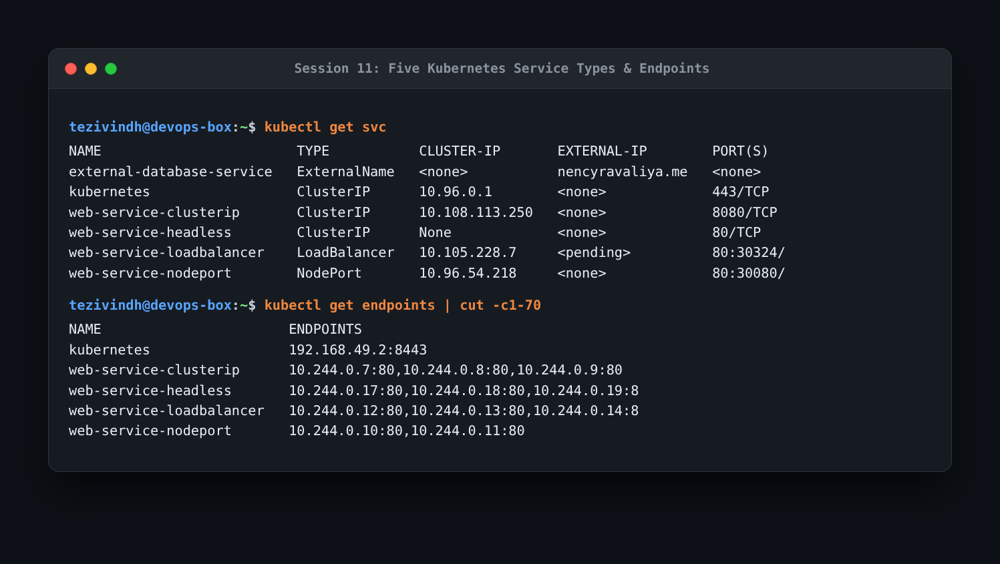
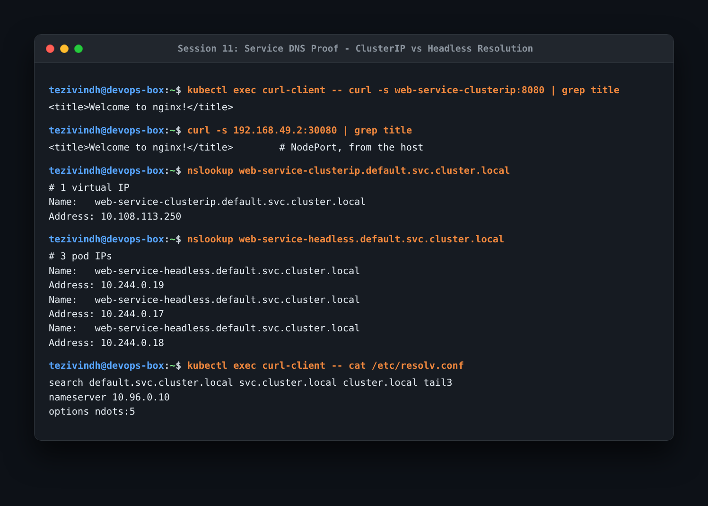
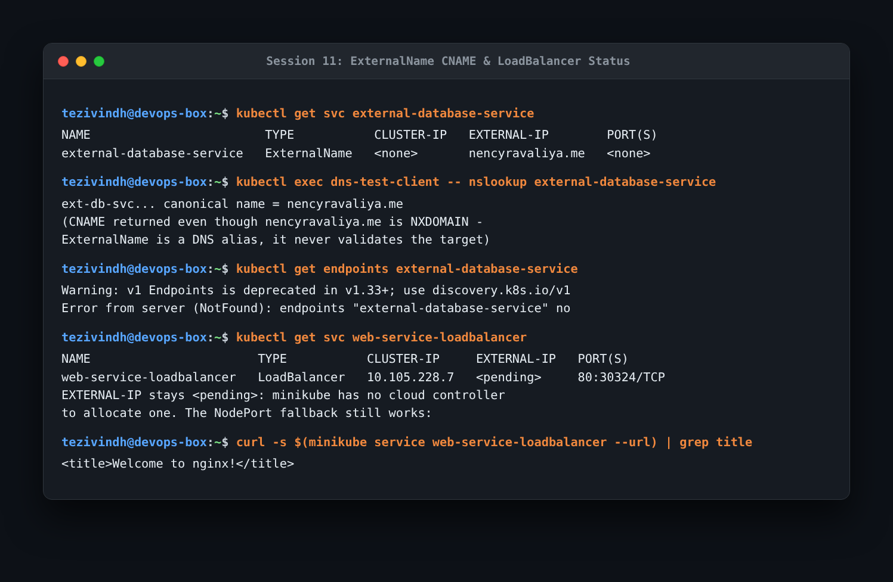
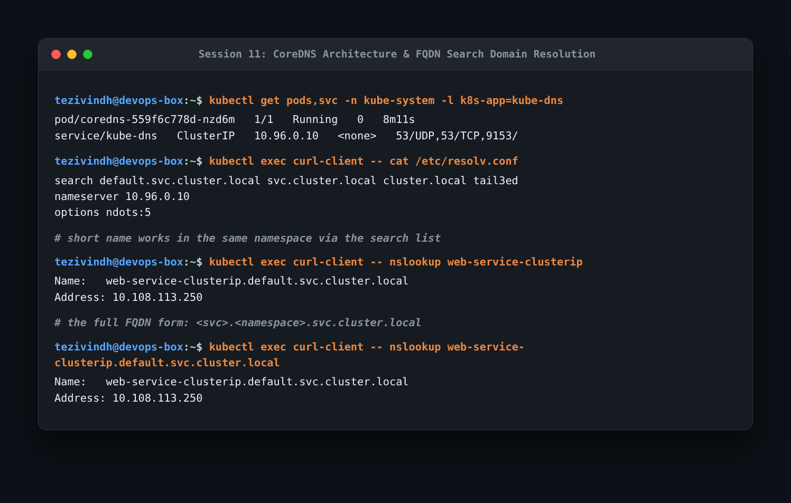
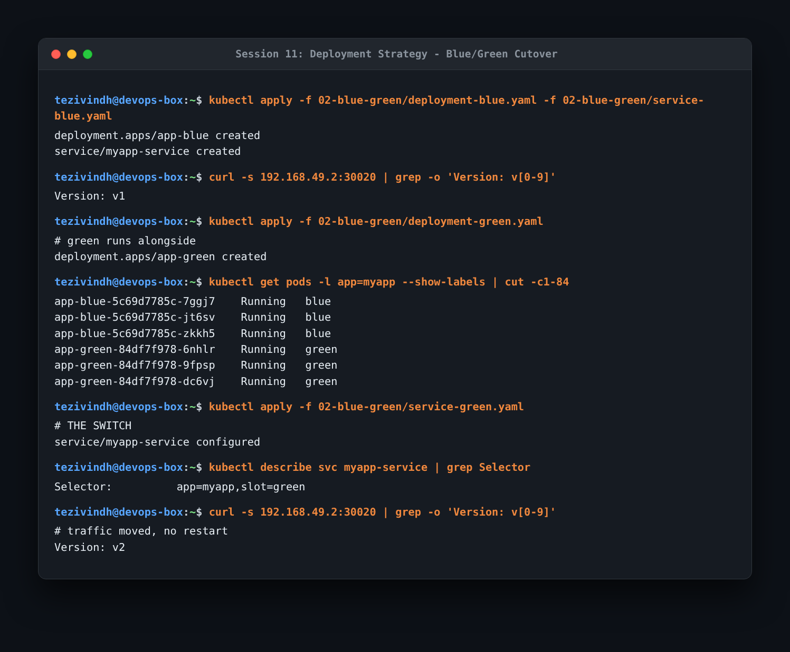
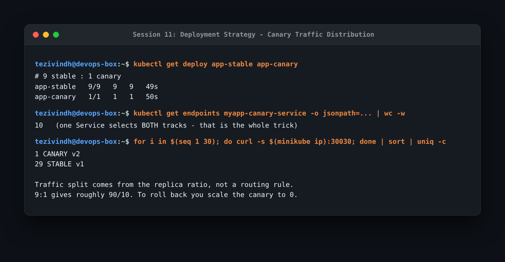
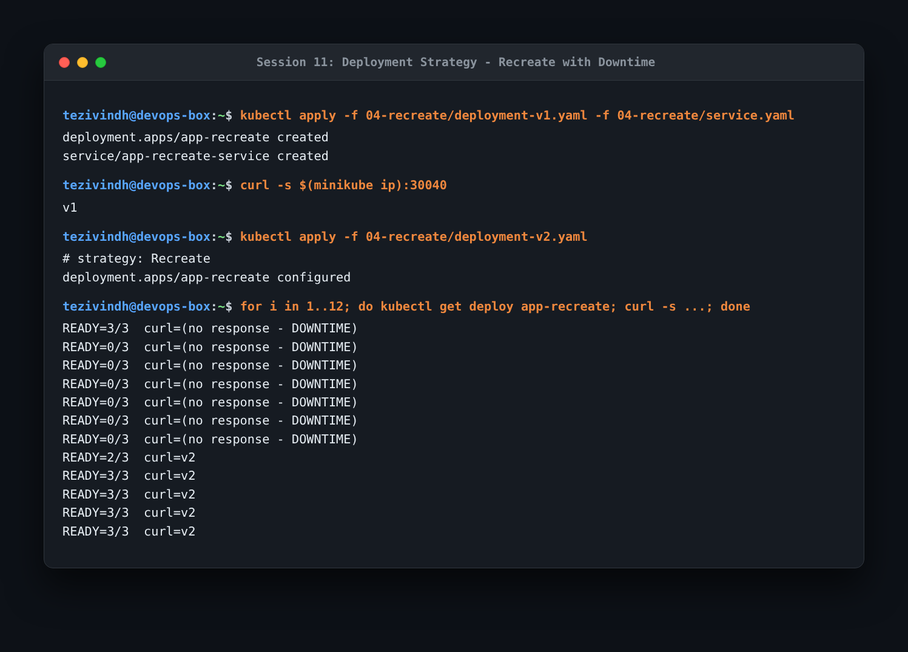
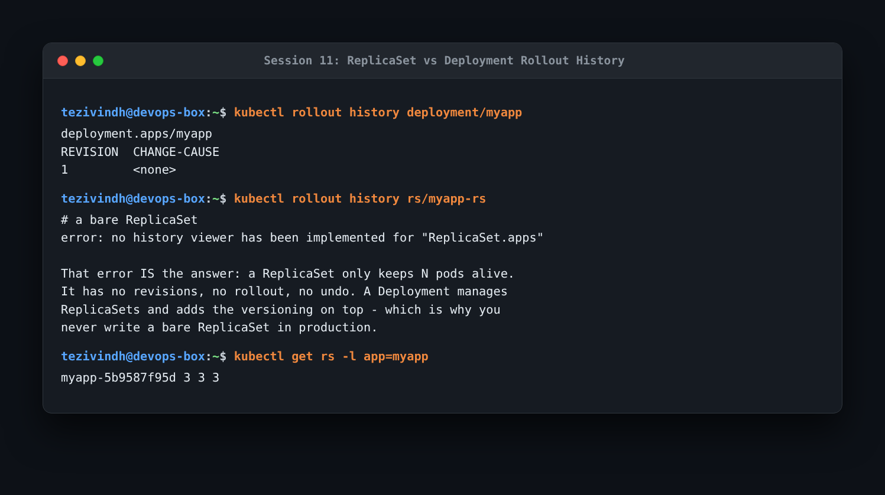

# Session 11: Kubernetes Services & Networking Homework

Kubernetes services, DNS discovery, and deployment strategies homework executed with Minikube. Screenshots are in the `assets/` and `screenshots/` folders.

---

### Task 1: Five Kubernetes Service Types & Endpoints
Inspected all five Kubernetes service types in a single cluster view along with their active endpoints.

```bash
kubectl get svc
kubectl get endpoints
```



- **What I understood**:
  - Pods are ephemeral and their IP addresses change whenever they restart. A **Service** provides a durable, static virtual IP and DNS name that forwards traffic to pods matched by label selectors.
  - **ClusterIP** (default): Internal-only virtual IP for pod-to-pod communication.
  - **NodePort**: Allocates a static port (range 30000–32767) on each node interface, accessible externally.
  - **LoadBalancer**: Requests an external cloud load balancer IP; falls back to NodePort on Minikube.
  - **ExternalName**: Internal DNS alias returning an external CNAME; has no ClusterIP or endpoints.
  - **Headless** (`clusterIP: None`): Bypasses proxying and returns individual pod IPs directly.

---

### Task 2: Service DNS Proof — ClusterIP vs Headless
Compared DNS resolution behavior between standard ClusterIP and Headless services.

```bash
kubectl exec curl-client -- curl -s web-service-clusterip:8080 | grep title
curl -s 192.168.49.2:30080 | grep title
nslookup web-service-clusterip.default.svc.cluster.local
nslookup web-service-headless.default.svc.cluster.local
kubectl exec curl-client -- cat /etc/resolv.conf
```



- **What I understood**:
  - The **ClusterIP** service resolves to exactly one virtual IP (`10.108.113.250`). Traffic sent to it is load balanced across backend pods via `kube-proxy`.
  - The **Headless** service (`clusterIP: None`) resolves to three separate A records containing the direct IP addresses of each pod. This is crucial for stateful systems (e.g. database clusters) where clients need to communicate directly with specific nodes.

---

### Task 3: ExternalName & LoadBalancer Status
Examined ExternalName behavior and LoadBalancer handling in local environments.

```bash
kubectl get svc external-database-service
kubectl exec dns-test-client -- nslookup external-database-service
kubectl get endpoints external-database-service
kubectl get svc web-service-loadbalancer
curl -s $(minikube service web-service-loadbalancer --url) | grep title
```



- **What I understood**:
  - `ExternalName` returns a CNAME pointing to `nencyravaliya.me` without performing proxying or maintaining endpoints. Even if the upstream host is unavailable, the DNS alias lookup succeeds.
  - `web-service-loadbalancer` shows `<pending>` because Minikube lacks an integrated cloud controller manager to provision a cloud load balancer. However, it still serves traffic through its assigned NodePort.

---

### Task 4: CoreDNS Architecture & FQDN Resolution
Inspected CoreDNS and verified how pod search domains resolve short names vs fully qualified domain names (FQDNs).

```bash
kubectl get pods,svc -n kube-system -l k8s-app=kube-dns
kubectl exec curl-client -- cat /etc/resolv.conf
kubectl exec curl-client -- nslookup web-service-clusterip
kubectl exec curl-client -- nslookup web-service-clusterip.default.svc.cluster.local
```



- **What I understood**:
  - The full Kubernetes FQDN follows `<service-name>.<namespace>.svc.cluster.local`.
  - Inside a pod, `/etc/resolv.conf` defines search domains (`default.svc.cluster.local`, `svc.cluster.local`, `cluster.local`). This is why short names work inside the same namespace.
  - `ndots:5` instructs the resolver to append search domains first before querying public DNS for domains with fewer than 5 dots.

---

### Task 5: Blue/Green Deployment Strategy
Tested zero-downtime deployment by spinning up Green alongside Blue and switching the Service selector.

```bash
kubectl apply -f 02-blue-green/deployment-blue.yaml -f 02-blue-green/service-blue.yaml
curl -s 192.168.49.2:30020 | grep -o "Version: v[0-9]"
kubectl apply -f 02-blue-green/deployment-green.yaml
kubectl get pods -l app=myapp --show-labels
kubectl apply -f 02-blue-green/service-green.yaml
curl -s 192.168.49.2:30020 | grep -o "Version: v[0-9]"
```



- **What I understood**: Blue and Green versions run concurrently. Once Green is verified, updating the service selector (`slot: green`) instantly redirects all incoming traffic with zero downtime. The trade-off is higher infrastructure cost since two full application stacks run in parallel during rollout.

---

### Task 6: Canary Deployment Strategy
Deployed stable and canary pods behind a single shared Service to test canary traffic splitting.

```bash
kubectl get deploy app-stable app-canary
kubectl get endpoints myapp-canary-service
for i in $(seq 1 30); do curl -s $(minikube ip):30030; done | sort | uniq -c
```



- **What I understood**: One Service routes traffic across pods from both deployments based on label matching. In a 9:1 replica ratio, testing with 30 requests yielded 29 stable (v1) and 1 canary (v2). Kubernetes routes purely by replica count; rolling back simply requires scaling the canary deployment to 0.

---

### Task 7: Recreate Deployment Strategy
Demonstrated the Recreate update strategy and observed the associated downtime.

```bash
kubectl apply -f 04-recreate/deployment-v1.yaml -f 04-recreate/service.yaml
kubectl apply -f 04-recreate/deployment-v2.yaml
for i in 1..12; do kubectl get deploy app-recreate; curl -s ...; done
```



- **What I understood**: With `strategy: Recreate`, all v1 pods are terminated before any v2 pods start creating. The loop clearly captured multiple seconds of connection failures (`no response - DOWNTIME`). This strategy is appropriate when old and new versions cannot run concurrently (e.g. database schema migrations).

---

### Task 8: ReplicaSet vs Deployment Rollout History
Compared management capabilities of a bare ReplicaSet versus a Deployment.

```bash
kubectl rollout history deployment/myapp
kubectl rollout history rs/myapp-rs
kubectl get rs -l app=myapp
```



- **What I understood**: Running `kubectl rollout history` against a bare ReplicaSet fails with `error: no history viewer has been implemented for "ReplicaSet.apps"`. A bare ReplicaSet only maintains a pod count; it lacks rollback, rollout status, and revision history. Deployments manage ReplicaSets and provide declarative versioning.
