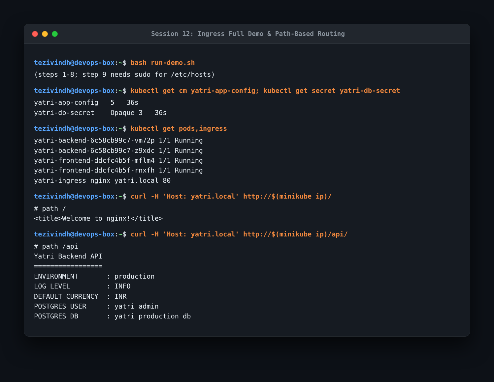
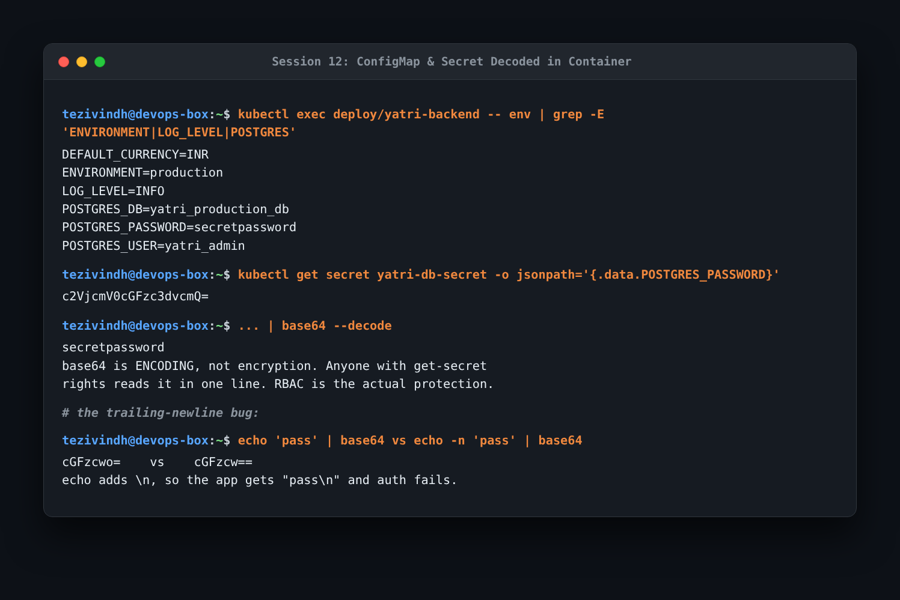
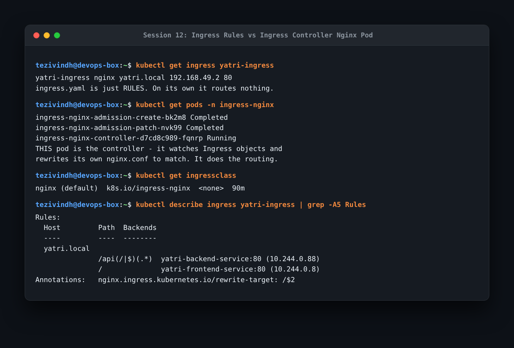

# Session 12: Kubernetes Ingress, ConfigMaps & Secrets Homework

Ingress, ConfigMaps, and Secrets homework executed with Minikube and the Nginx Ingress addon. Screenshots are in the `assets/` and `screenshots/` folders.

---

### Task 1: Full Ingress, Service & Application Stack Demo
Executed `run-demo.sh` to configure the end-to-end stack: enabling ingress addon, applying ConfigMap and Secret, deploying frontend and backend services, applying ingress routing, and verifying HTTP endpoints.

```bash
bash run-demo.sh
kubectl get cm yatri-app-config; kubectl get secret yatri-db-secret
kubectl get pods,ingress
curl -H "Host: yatri.local" http://$(minikube ip)/
curl -H "Host: yatri.local" http://$(minikube ip)/api/
```



- **What I understood**:
  - Requesting `Host: yatri.local` at path `/` routes to the frontend Nginx service.
  - Requesting `Host: yatri.local` at path `/api/` routes to the backend service.
  - The Ingress path rule `/api(/|$)(.*)` uses annotation `nginx.ingress.kubernetes.io/rewrite-target: /$2` so that the `/api` prefix is stripped before forwarding to the backend container, allowing the backend to serve from `/`. Omitting this rewrite is one of the most frequent Ingress configuration errors.

---

### Task 2: ConfigMap, Secret Injection & Base64 Trailing Newlines
Inspected injected environment variables in the backend pod and decoded the database secret.

```bash
kubectl exec deploy/yatri-backend -- env | grep -E "ENVIRONMENT|LOG_LEVEL|POSTGRES"
kubectl get secret yatri-db-secret -o jsonpath="{.data.POSTGRES_PASSWORD}"
kubectl get secret yatri-db-secret -o jsonpath="{.data.POSTGRES_PASSWORD}" | base64 --decode
echo "pass" | base64
echo -n "pass" | base64
```



- **What I understood**:
  - **ConfigMap**: Holds non-sensitive environment configuration so the same container image can be promoted across environments without changes.
  - **Secret**: Encodes sensitive values like passwords. **Base64 is an encoding, not encryption**. Anyone with `get secrets` permissions can decode values in one command. True security relies on Kubernetes RBAC and etcd encryption-at-rest.
  - **The Newline Pitfall**: Running `echo "pass" | base64` includes a trailing `\n` (`cGFzcwo=`). When consumed by applications, the password will contain `pass\n`, causing authentication failures. Always use `echo -n` (`cGFzcw==`) when encoding secrets.

---

### Task 3: Ingress Resource vs Ingress Controller
Distinguished between the Kubernetes Ingress resource and the Ingress Controller daemon.

```bash
kubectl get ingress yatri-ingress
kubectl get pods -n ingress-nginx
kubectl get ingressclass
kubectl describe ingress yatri-ingress | grep -A5 Rules
```



- **What I understood**:
  - The **Ingress resource** (`ingress.yaml`) is merely an inert declarative configuration object defining routing rules. By itself, it handles zero network traffic.
  - The **Ingress Controller** (such as `ingress-nginx-controller-d7cd8c989-fqnrp`) is an active reverse proxy pod that listens to Kubernetes API events, parses Ingress resources, and dynamically rewrites its internal Nginx configuration.
  - Ingress acts as an HTTP/HTTPS application-layer router, consolidating traffic under a single entry point and terminating TLS, avoiding the expense and quota of provisioning separate cloud LoadBalancers for each microservice.
