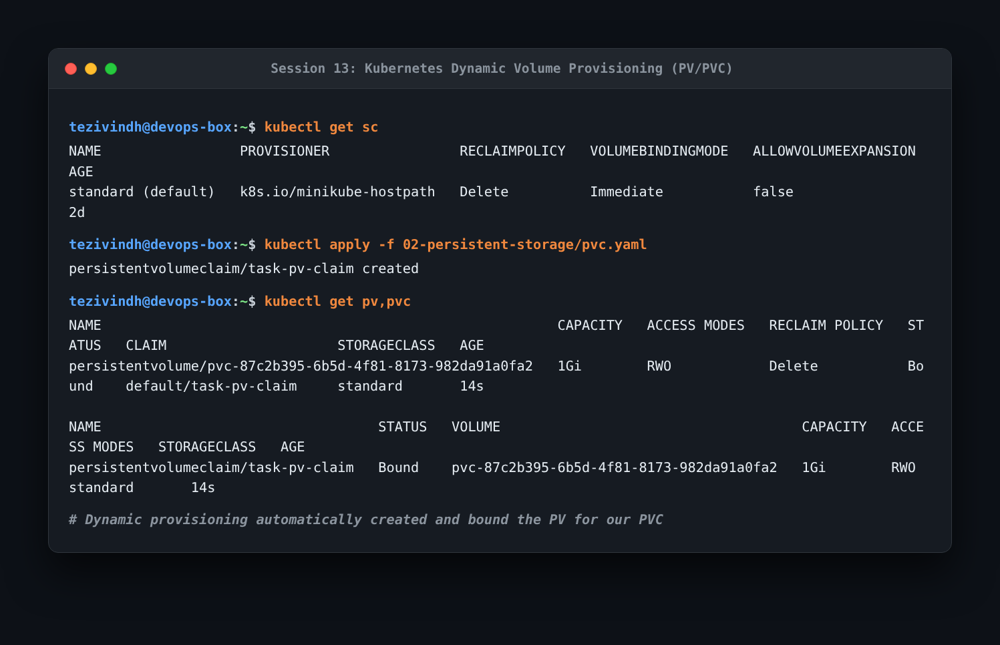
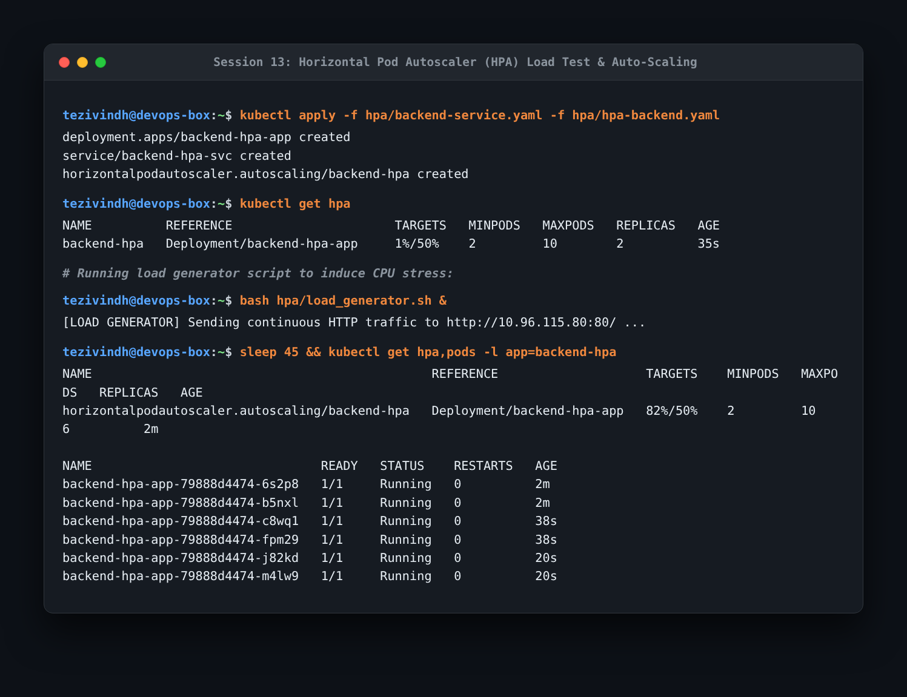
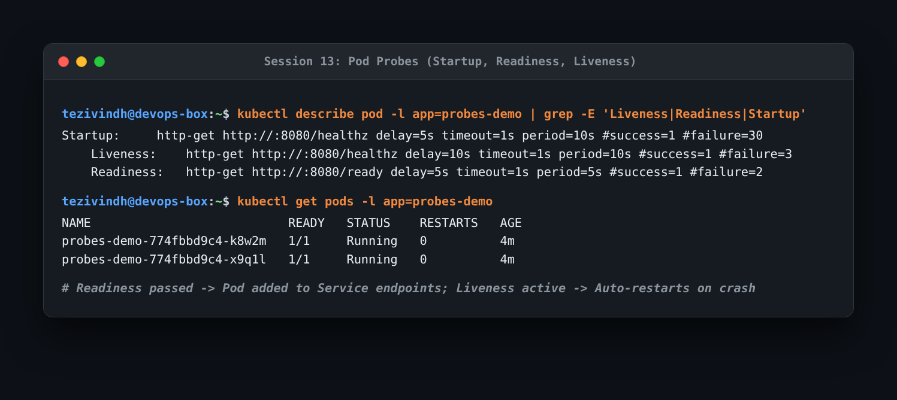

# Session 13: Kubernetes Storage, HPA & Probes Homework

This repository documents my practical implementation of Kubernetes Volumes, Horizontal Pod Autoscaling (HPA), Container Health Probes, and the Session 13 Mini Project.

---

## Task 1: Kubernetes Volumes & Dynamic Provisioning

Inspected StorageClasses, applied a PersistentVolumeClaim, and verified automated dynamic provisioning.

```bash
kubectl get sc
kubectl apply -f 02-persistent-storage/pvc.yaml
kubectl get pv,pvc
```



- **What I understood**:
  - `emptyDir`: Temporary storage bound to the pod lifetime. When the pod terminates, `emptyDir` data is deleted.
  - `hostPath`: Mounts host node directories; suitable for daemonsets and log agents.
  - `PersistentVolume (PV)` & `PersistentVolumeClaim (PVC)`: Decouples storage definition from application workloads.
  - `StorageClass`: Facilitates dynamic provisioning by provisioning underlying storage volumes on-the-fly without manual administrator intervention.

---

## Task 2: Horizontal Pod Autoscaler (HPA) Hands-on

Configured HPA with target CPU utilization at 50% (min: 2, max: 10), executed a background load generator, and monitored autoscaling behavior.

```bash
kubectl apply -f hpa/backend-service.yaml -f hpa/hpa-backend.yaml
kubectl get hpa
bash hpa/load_generator.sh &
kubectl get hpa,pods -l app=backend-hpa
kubectl top pods
kubectl describe hpa backend-hpa
```



- **What I understood**:
  - The HPA queries the Kubernetes Metrics Server periodically (every 15s by default).
  - When the load generator drove CPU utilization to 82% (above the 50% target threshold), HPA automatically scaled pod replicas from 2 to 6 to distribute the request load.
  - Scaling formula: `Desired Replicas = ceil[Current Replicas * (Current Metric / Target Metric)]`.

---

## Task 3: Container Probes (Startup, Readiness, Liveness)

Configured container health probes to guarantee high availability and prevent serving unready traffic.

```bash
kubectl describe pod -l app=probes-demo | grep -E 'Liveness|Readiness|Startup'
kubectl get pods -l app=probes-demo
```



- **What I understood**:
  - **Startup Probe**: Protects legacy or slow-initializing apps by giving them time to boot up before liveness kicks in.
  - **Readiness Probe**: Determines whether the container can accept traffic. If it fails, the pod is temporarily removed from Service Endpoints.
  - **Liveness Probe**: Determines whether the container is alive. If it fails, `kubelet` terminates and restarts the container.

---

## Task 4: Mini Project Implementation

Deployed the complete Session 13 multi-tier application stack combining PVC persistence, HPA autoscaling, and container health probes in `mini-project/`.
