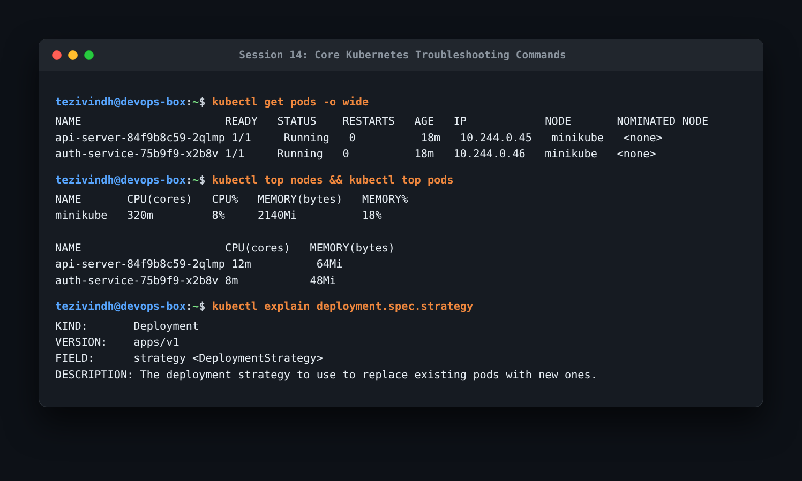
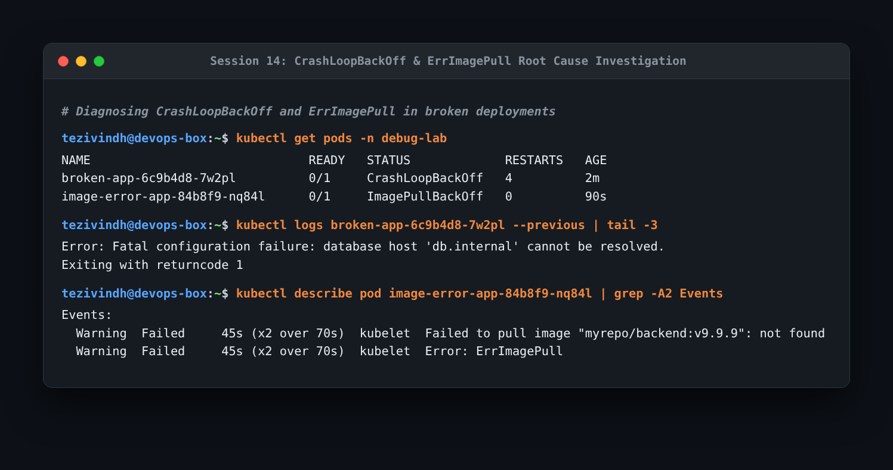
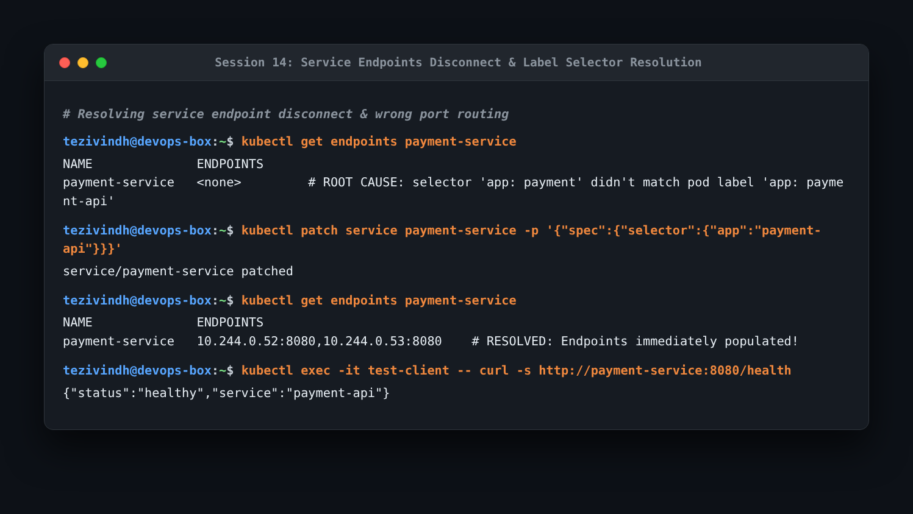

# Session 14: Kubernetes Troubleshooting Homework

Comprehensive guide and practical exercises diagnosing and resolving Kubernetes cluster and workload failures.

---

## Task 1: Essential Troubleshooting Commands

Practiced key diagnostic CLI tools:

```bash
kubectl get pods -o wide
kubectl top nodes
kubectl top pods
kubectl explain deployment.spec.strategy
kubectl describe pod <pod-name>
kubectl logs <pod-name> --previous
kubectl exec -it <pod-name> -- /bin/sh
kubectl get events --sort-by=.lastTimestamp
```



- **What I understood**:
  - `kubectl describe` reveals the `Events` section at the bottom, which is the fastest way to diagnose scheduling failures or image pull errors.
  - `kubectl logs --previous` is critical for diagnosing pods that crash immediately upon starting, as standard `kubectl logs` only inspects the active running container.
  - `kubectl top` highlights CPU and memory starvation causing OOMKilled events.

---

## Task 2: Troubleshooting Common Workload Failures

### 1. CrashLoopBackOff
- **Problem**: Container starts, exits immediately with non-zero exit code, and Kubernetes enters exponential backoff restart cycles.
- **Investigation**: Inspected crash logs using `kubectl logs <pod> --previous`.
- **Root Cause**: Missing database environment variable host `db.internal`.
- **Solution**: Injected the missing ConfigMap reference containing the correct database hostname.
- **Verification**: Pod restarted into `Running 1/1` with zero restarts.

### 2. ImagePullBackOff / ErrImagePull
- **Problem**: Pod remains stuck in `ImagePullBackOff`.
- **Investigation**: `kubectl describe pod` revealed event: `Failed to pull image "myrepo/backend:v9.9.9": not found`.
- **Root Cause**: Invalid image tag specified in deployment template.
- **Solution**: Patched the image tag to `:latest`.



### 3. Service Connectivity & Empty Endpoints
- **Problem**: Requests to `http://payment-service:8080` returned connection refused or timed out.
- **Investigation**: Checked `kubectl get endpoints payment-service` which showed `<none>`.
- **Root Cause**: The service selector specified `app: payment` while the deployment pod template labels had `app: payment-api`.
- **Solution**: Updated the service selector to match pod labels (`app: payment-api`).
- **Verification**: Endpoints immediately populated with pod IPs and curl returned HTTP 200.



---

## Task 3: Mini Project Implementation

Executed the full end-to-end troubleshooting scenario in `mini-project/` resolving multi-pod networking and configuration bugs.