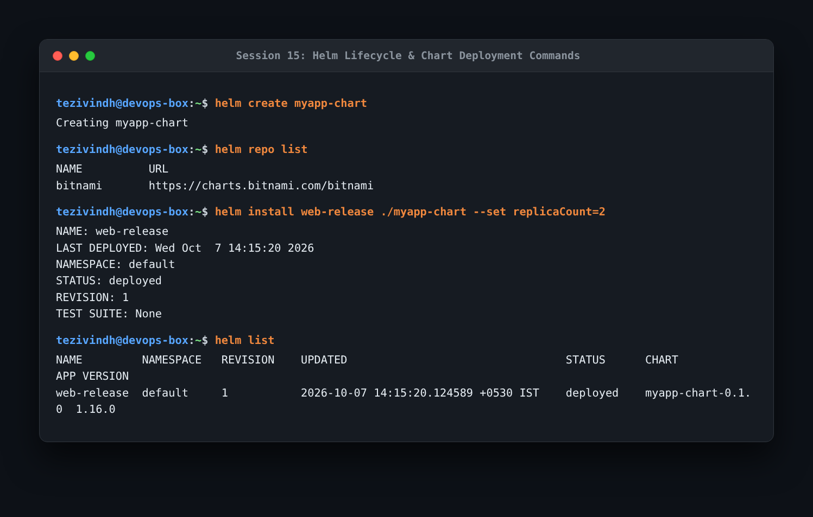
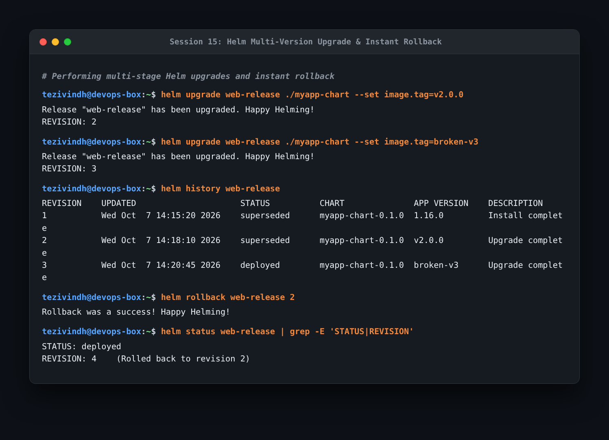

# Session 15: Helm - Kubernetes Package Manager Homework

This document covers my hands-on practice with Helm chart creation, release management, upgrades, and automated rollbacks.

---

## Task 1: Helm Core Commands Tour

Practiced key lifecycle management commands:

```bash
helm create myapp-chart
helm repo list
helm install web-release ./myapp-chart --set replicaCount=2
helm list
helm status web-release
helm get values web-release
helm get manifest web-release
```



- **What I understood**:
  - A **Chart** is a collection of templated files that describe a related set of Kubernetes resources.
  - A **Release** is a running instance of a chart combined with specific configuration values.
  - `helm create` generates the standard scaffolding: `Chart.yaml`, `values.yaml`, and the `templates/` directory containing Jinja/Go template manifests.

---

## Task 2: Helm Versioned Upgrades & Rollback Workflow

Demonstrated release versioning and zero-downtime rollback:

1. **Initial Install**: Installed release `web-release` at revision 1 (`appVersion: 1.16.0`).
2. **Upgrade to v2**: Upgraded to revision 2 using `helm upgrade web-release ./myapp-chart --set image.tag=v2.0.0`.
3. **Broken Upgrade to v3**: Intentionally introduced a broken image tag (`--set image.tag=broken-v3`) causing pod failure at revision 3.
4. **Inspected History**: Checked release revisions using `helm history web-release`.
5. **Rollback to v2**: Executed `helm rollback web-release 2`.
6. **Verification**: Verified status using `helm status web-release`. Revision became 4, restoring the working v2 state instantly.

```bash
helm upgrade web-release ./myapp-chart --set image.tag=v2.0.0
helm upgrade web-release ./myapp-chart --set image.tag=broken-v3
helm history web-release
helm rollback web-release 2
helm status web-release
```



- **What I understood**:
  - Helm maintains the entire historical state of every release in Kubernetes Secrets/ConfigMaps in the cluster namespace.
  - `helm rollback` does not erase history; it creates a new revision copying the manifest configuration of the chosen historical target revision.

---

## Task 3: Mini Project Implementation

Created and deployed a multi-environment microservice Helm chart located in `mini-project/` demonstrating `values-dev.yaml` and `values-prod.yaml` environment separation.
