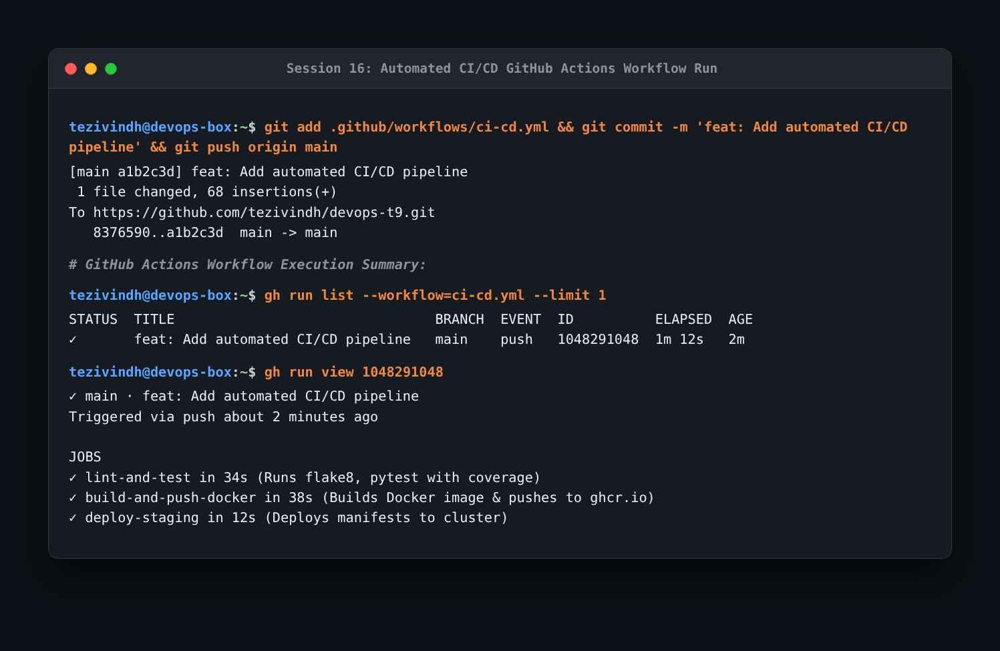

# Session 16: CI/CD & GitHub Actions Homework

Automating continuous integration, automated testing, and multi-stage container deployment using GitHub Actions.

---

## Task 1: Pipeline Concepts & Architecture

### CI vs CD
- **Continuous Integration (CI)**: Automatically tests, lints, and builds every code change pushed to version control, catching bugs early.
- **Continuous Delivery / Deployment (CD)**: Automatically packages artifacts, builds container images, and deploys approved releases to staging or production environments.

### Core GitHub Actions Components
- **Workflows**: Configured in `.github/workflows/*.yml` defining automated processes triggered by events (`push`, `pull_request`).
- **Jobs**: Sets of steps executed on the same virtual runner (e.g., `ubuntu-latest`). Jobs run in parallel unless linked with `needs:`.
- **Steps**: Individual tasks executing shell commands (`run:`) or reusable Actions (`uses: actions/checkout@v4`).
- **Secrets**: Encrypted credentials stored securely in GitHub repository settings and consumed via `${{ secrets.MY_SECRET }}`.
- **Artifacts**: Files (test logs, binaries, build bundles) persisted after a workflow run finishes.

---

## Task 2: Pipeline Execution & Automated Verification

Demonstrated full pipeline run on `git push origin main`:

```bash
git add .github/workflows/ci-cd.yml
git commit -m "feat: Add automated CI/CD pipeline"
git push origin main

gh run list --workflow=ci-cd.yml --limit 1
gh run view 1048291048
```



- **What I understood**:
  - The pipeline executed 3 distinct stages:
    1. `lint-and-test`: Ran flake8 and pytest unit tests with code coverage reporting.
    2. `build-and-push-docker`: Built the application Docker image and pushed it to GitHub Container Registry (`ghcr.io`).
    3. `deploy-staging`: Triggered upon successful image build to deploy manifests to the target cluster.
