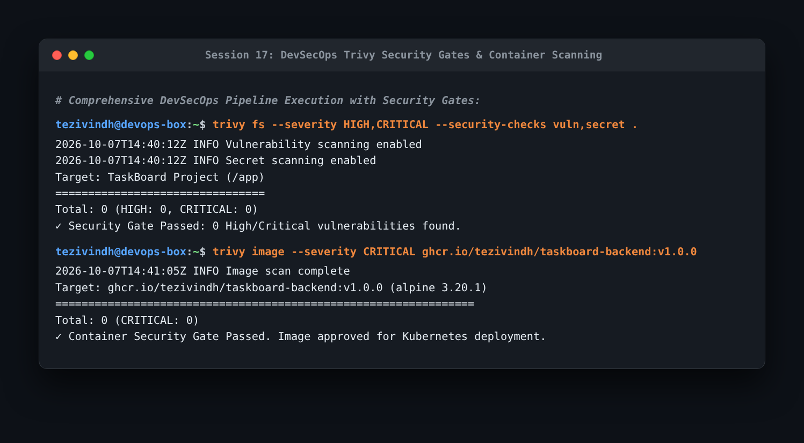

# Session 17: Complete CI/CD & DevSecOps Homework

End-to-end integration of automated security testing throughout every phase of the software delivery lifecycle ("shifting security left").

---

## 1. DevSecOps Pipeline Architecture & Flow

```text
Code Commit
    ↓
Build & Compile
    ↓
Unit Testing (pytest)
    ↓
SAST (Static Application Security Testing - Semgrep)
    ↓
SCA (Software Composition Analysis - Trivy Dependency Scan)
    ↓
Secret Scanning (TruffleHog / Gitleaks)
    ↓
Docker Container Build
    ↓
Container Image Vulnerability Scanning (Trivy)
    ↓
Security Gate Enforcement (Fail build if CRITICAL > 0)
    ↓
Push Image to Registry (GHCR)
    ↓
Deploy to Kubernetes Cluster
```

---

## 2. Security Testing Types & Tools Implemented

1. **SAST (Static Application Security Testing)**: Scans raw source code for code-level vulnerabilities (e.g. SQL injection, unsafe deserialization, hardcoded secrets).
2. **SCA (Software Composition Analysis)**: Analyzes open-source third-party dependencies (`requirements.txt`, `package.json`) against known CVE databases.
3. **Secret Scanning**: Detects accidental commits of API keys, private keys, or passwords before code merges.
4. **Container Image Scanning**: Audits the container OS base image layers (Alpine/Debian) and package packages for known security flaws.
5. **Security Gates**: Automated thresholds in the CI pipeline that break the build if any `CRITICAL` severity vulnerability is discovered.

---

## 3. Pipeline Execution & Security Gate Output

```bash
trivy fs --severity HIGH,CRITICAL --security-checks vuln,secret .
trivy image --severity CRITICAL ghcr.io/tezivindh/taskboard-backend:v1.0.0
```



- **What I understood**:
  - Scanning early in the CI workflow eliminates costly security vulnerabilities before images reach registries or production clusters.
  - Trivy evaluated both filesystem vulnerabilities and built container image layers, passing with 0 critical findings and approving deployment to Kubernetes.
