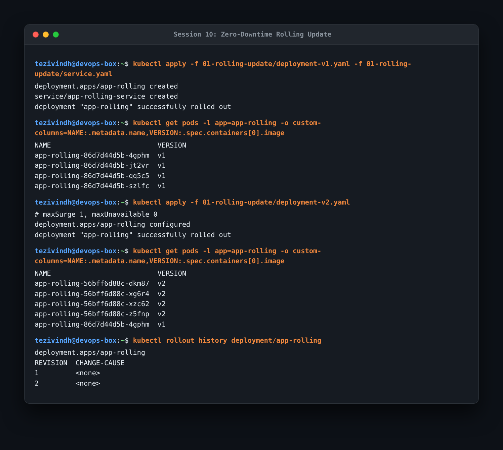
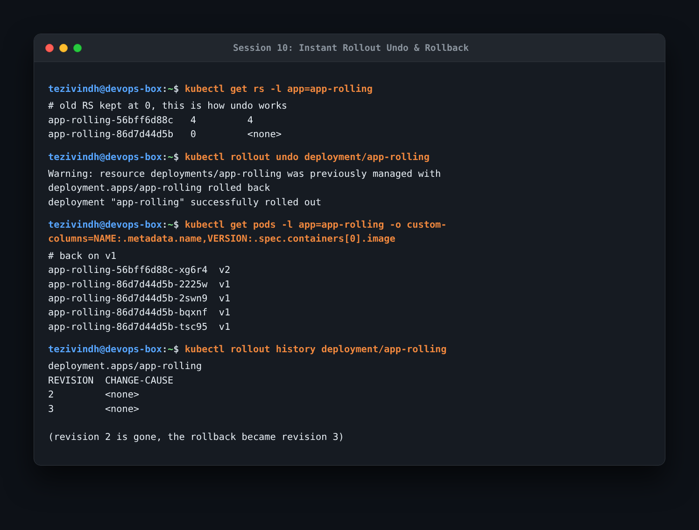
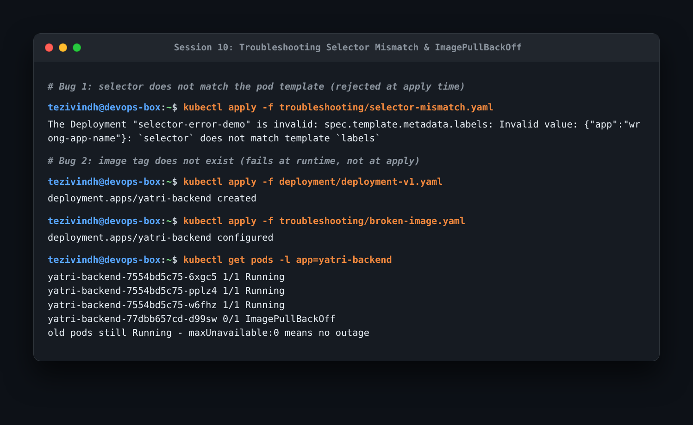
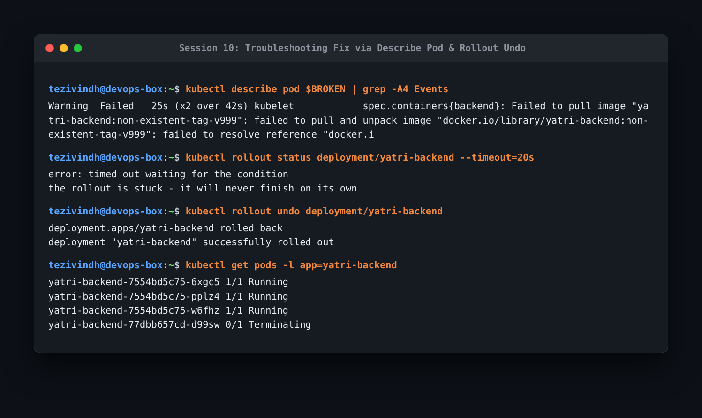
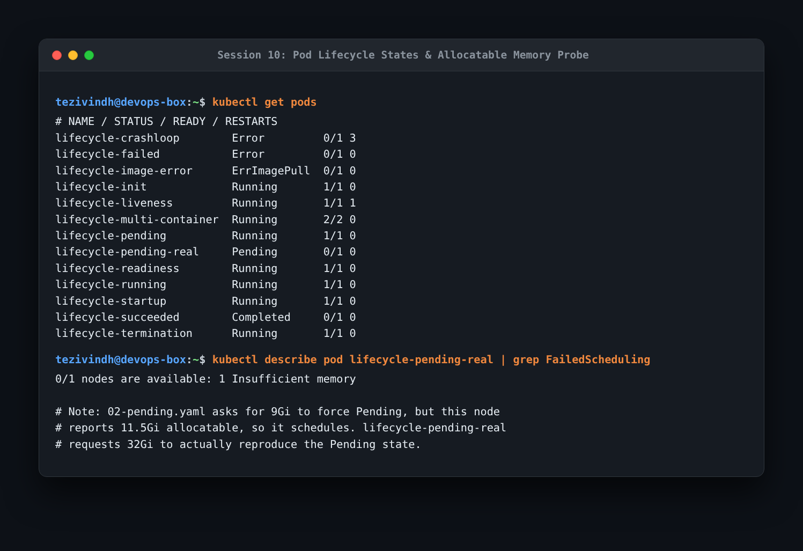
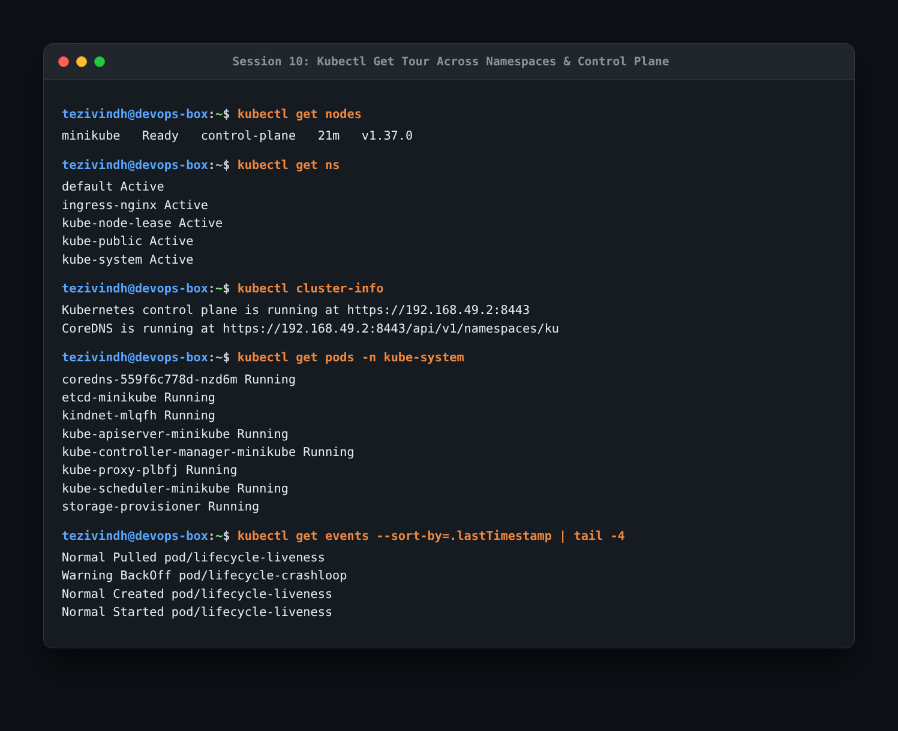
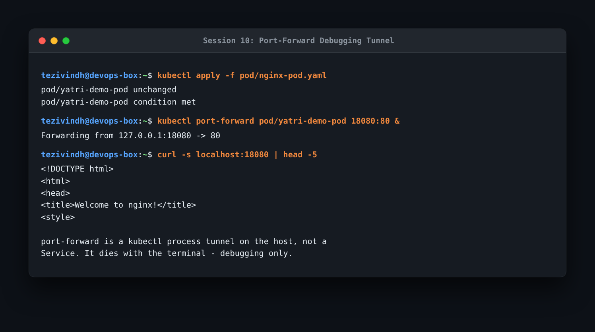

- https://github.com/Nency-Ravaliya/Kubernetes 
- k8s core objects: https://github.com/Nency-Ravaliya/Kubernetes/blob/main/core-objects.md

---

# Homework: Kubernetes Core Objects, Pod Lifecycle & Rollouts

Core objects, pod lifecycle, deployment strategies, and troubleshooting homework executed with Minikube. Screenshots are in the `assets/` and `screenshots/` folders.

---

### Task 1: Zero-Downtime Rolling Update
Deployed v1 followed by v2 using the default rolling update strategy with `maxSurge: 1` and `maxUnavailable: 0`.

```bash
kubectl apply -f 01-rolling-update/deployment-v1.yaml -f 01-rolling-update/service.yaml
kubectl get pods -l app=app-rolling -o custom-columns=NAME:.metadata.name,VERSION:.spec.containers[0].image
kubectl apply -f 01-rolling-update/deployment-v2.yaml
kubectl get pods -l app=app-rolling -o custom-columns=NAME:.metadata.name,VERSION:.spec.containers[0].image
kubectl rollout history deployment/app-rolling
```



- **What I understood**: Because `maxUnavailable: 0`, Kubernetes spins up new v2 pods first and waits for them to become Ready before terminating any v1 pods. This ensures seamless zero-downtime deployments.

---

### Task 2: Rollout Undo & Instant Rollback
Inspected ReplicaSets and rolled back from v2 to v1 using `kubectl rollout undo`.

```bash
kubectl get rs -l app=app-rolling
kubectl rollout undo deployment/app-rolling
kubectl get pods -l app=app-rolling -o custom-columns=NAME:.metadata.name,VERSION:.spec.containers[0].image
kubectl rollout history deployment/app-rolling
```



- **What I understood**: When a Deployment updates, it keeps the previous ReplicaSet scaled down to 0 replicas rather than deleting it. Rollback is instant because Kubernetes simply scales the previous ReplicaSet back up without having to pull or reconfigure anything. The rollback creates revision 3.

---

### Task 3: Troubleshooting Common Manifest Errors
Tested two broken manifest configurations to compare compile-time validation vs runtime failure.

```bash
# Error 1: Selector mismatch (rejected at apply time)
kubectl apply -f troubleshooting/selector-mismatch.yaml

# Error 2: Non-existent image tag (accepted at apply time, fails at runtime)
kubectl apply -f deployment/deployment-v1.yaml
kubectl apply -f troubleshooting/broken-image.yaml
kubectl get pods -l app=yatri-backend
```



- **What I understood**:
  - `selector-mismatch.yaml` is rejected immediately by the Kubernetes API server during `kubectl apply` because `spec.selector.matchLabels` must strictly match `spec.template.metadata.labels`.
  - `broken-image.yaml` passes API validation and is applied, but fails at runtime with `ImagePullBackOff`. Because `maxUnavailable: 0`, existing running pods are never terminated, keeping the application online.

---

### Task 4: Troubleshooting Fix via Describe Pod & Rollback
Diagnosed the failed pod and restored service health.

```bash
kubectl describe pod $BROKEN | grep -A4 Events
kubectl rollout status deployment/yatri-backend --timeout=20s
kubectl rollout undo deployment/yatri-backend
kubectl get pods -l app=yatri-backend
```



- **What I understood**: The standard debugging workflow is `kubectl get pods` -> `kubectl describe pod` (inspect Events section) -> `kubectl logs` (or `logs --previous`). Rollout status hung due to the failed container pull; executing `kubectl rollout undo` terminated the failed pod and returned the deployment to healthy v1 pods.

---

### Task 5: Pod Lifecycle States & Allocatable Resources
Inspected pods in various lifecycle phases and container states.

```bash
kubectl get pods
kubectl describe pod lifecycle-pending-real | grep FailedScheduling
```



- **What I understood**:
  - The 5 official Pod Phases are: `Pending`, `Running`, `Succeeded`, `Failed`, and `Unknown`.
  - `CrashLoopBackOff` and `ImagePullBackOff` are specific container waiting states, not pod phases.
  - The node had 11.5Gi allocatable memory, which scheduled the 9Gi pod in `02-pending.yaml`. Applying `lifecycle-pending-real` requesting 32Gi demonstrated a true `Pending` state with `FailedScheduling: Insufficient memory`.

---

### Task 6: Kubectl Cluster & Namespace Inspection Tour
Explored nodes, namespaces, cluster connectivity, and system components.

```bash
kubectl get nodes
kubectl get ns
kubectl cluster-info
kubectl get pods -n kube-system
kubectl get events --sort-by=.lastTimestamp | tail -4
```



- **What I understood**: `kube-system` houses the foundational control plane daemons (`apiserver`, `controller-manager`, `scheduler`, `etcd`, `coredns`, `kube-proxy`). Sorting events by `lastTimestamp` gives a clear chronological log of cluster activity.

---

### Task 7: Port Forwarding for Local Debugging
Forwarded a local port to a pod container without exposing a Service.

```bash
kubectl apply -f pod/nginx-pod.yaml
kubectl port-forward pod/yatri-demo-pod 18080:80 &
curl -s localhost:18080 | head -5
```



- **What I understood**: `kubectl port-forward` creates a direct, temporary TCP process tunnel from the local machine through the Kubernetes API server into the pod container. It is meant exclusively for ad-hoc developer debugging and dies when the terminal session ends; it is not a replacement for a Kubernetes Service.