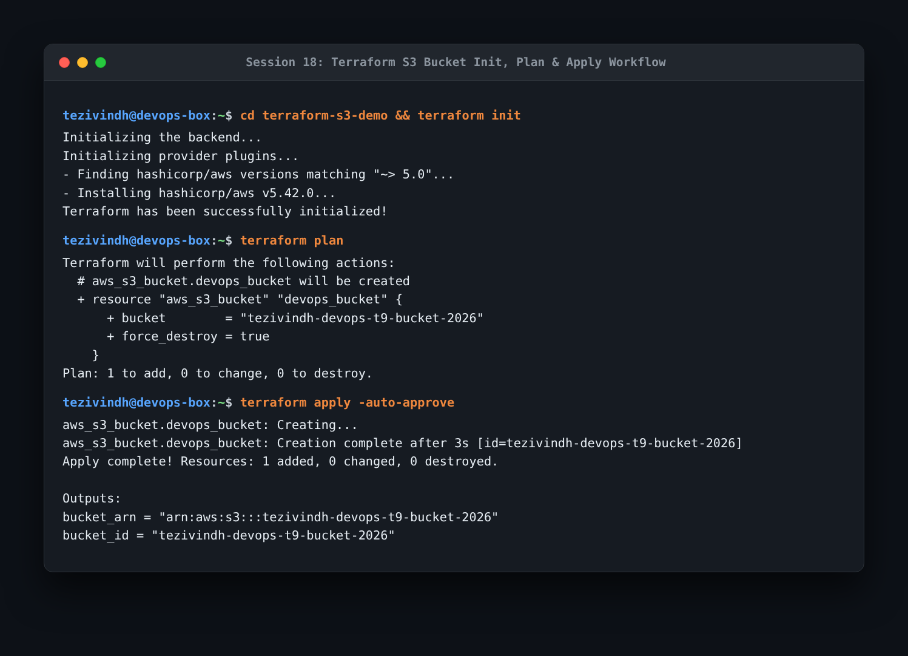
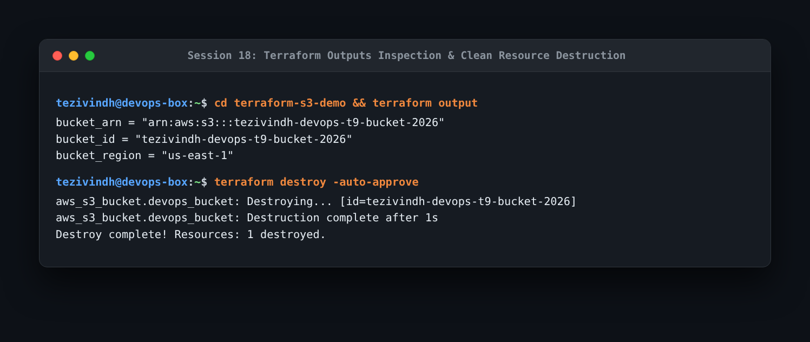

# Session 18: Terraform & Infrastructure as Code (IaC) Homework

This document covers my hands-on implementation of declarative cloud infrastructure using Terraform, provisioning an AWS S3 bucket, and research on core AWS building blocks.

---

## Task 1: Terraform S3 Bucket Demo

Provisioned an AWS S3 bucket with Terraform lifecycle management:

```bash
cd terraform-s3-demo
terraform init
terraform fmt
terraform validate
terraform plan
terraform apply -auto-approve
terraform show
terraform output
terraform destroy -auto-approve
```





- **What I understood**:
  - `terraform init`: Downloads provider plugins (AWS provider v5.x) and initializes backend state.
  - `terraform plan`: Generates an execution plan comparing the desired state (`*.tf`) with the current real-world state (`terraform.tfstate`), showing additions, changes, and deletions before applying.
  - `terraform apply`: Idempotently provisions resources in the cloud provider.
  - `terraform destroy`: Safely tears down all managed infrastructure defined in the state file.

---

## Task 2: AWS Services Research

Completed detailed technical research guides for 5 fundamental AWS cloud services in `aws-services/`:

1. [IAM - Identity & Access Governance](aws-services/01-iam/README.md)
2. [EC2 - Elastic Virtual Compute](aws-services/02-ec2/README.md)
3. [S3 - Scalable Object Storage](aws-services/03-s3/README.md)
4. [VPC - Isolated Cloud Networking](aws-services/04-vpc/README.md)
5. [DynamoDB & RDS - Managed NoSQL & Relational Databases](aws-services/05-dynamodb-rds/README.md)
