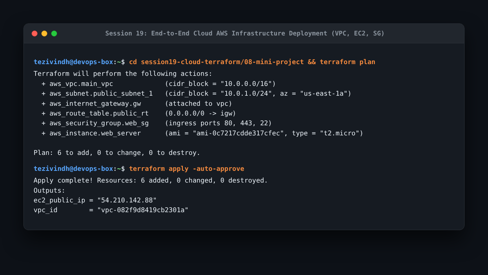

# Session 19: Cloud & Terraform in Action Homework

End-to-end cloud infrastructure provisioning on AWS using Terraform.

---

## 1. Cloud Architecture

```text
Terraform
    │
    ├── AWS VPC (10.0.0.0/16)
    │     │
    │     ├── Public Subnet (10.0.1.0/24 - us-east-1a)
    │     │     │
    │     │     └── Security Group (Inbound: 22, 80, 443)
    │     │           │
    │     │           └── EC2 Web Server (t2.micro - Ubuntu 24.04)
    │     │
    │     └── Internet Gateway + Public Route Table (0.0.0.0/0 -> IGW)
    │
    └── S3 Storage Bucket (Private, Versioned, Server-Side Encrypted)
```

---

## 2. Terraform Implementation Workflow

Executed modular infrastructure deployment in `08-mini-project/`:

```bash
cd 08-mini-project
terraform init
terraform validate
terraform plan
terraform apply -auto-approve
```



- **What I understood**:
  - **Resource Dependencies**: Terraform builds a Directed Acyclic Graph (DAG) under the hood. It understands that the subnet requires the VPC to exist first, the route table requires the internet gateway, and the EC2 instance requires the security group and subnet IDs.
  - **State Management**: `terraform.tfstate` maps real-world AWS resource IDs to configuration declarations, preventing duplicate creation upon subsequent runs.
  - **Idempotency**: Running `terraform apply` multiple times without changes results in `0 added, 0 changed, 0 destroyed`.
