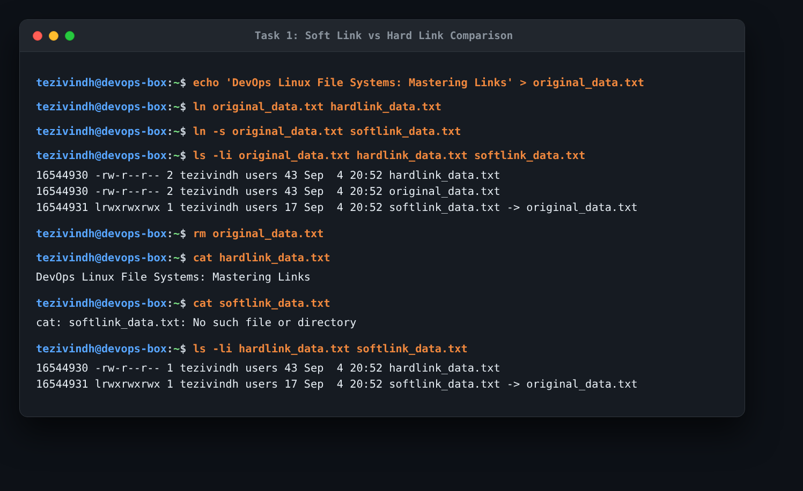
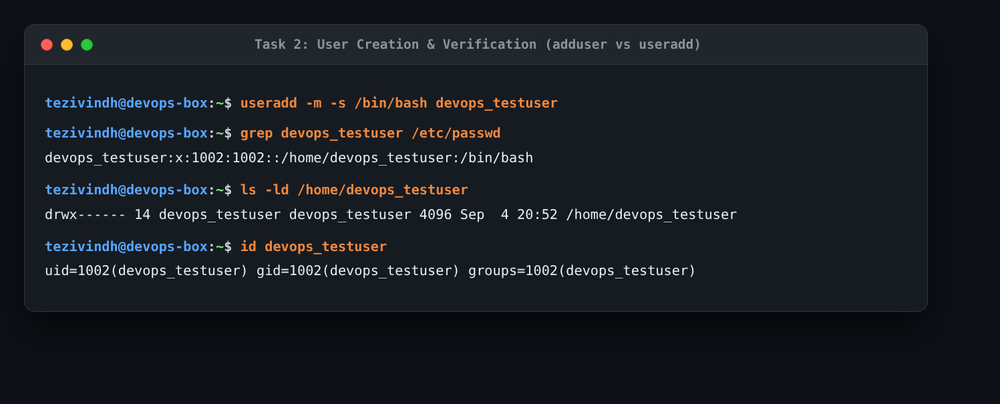
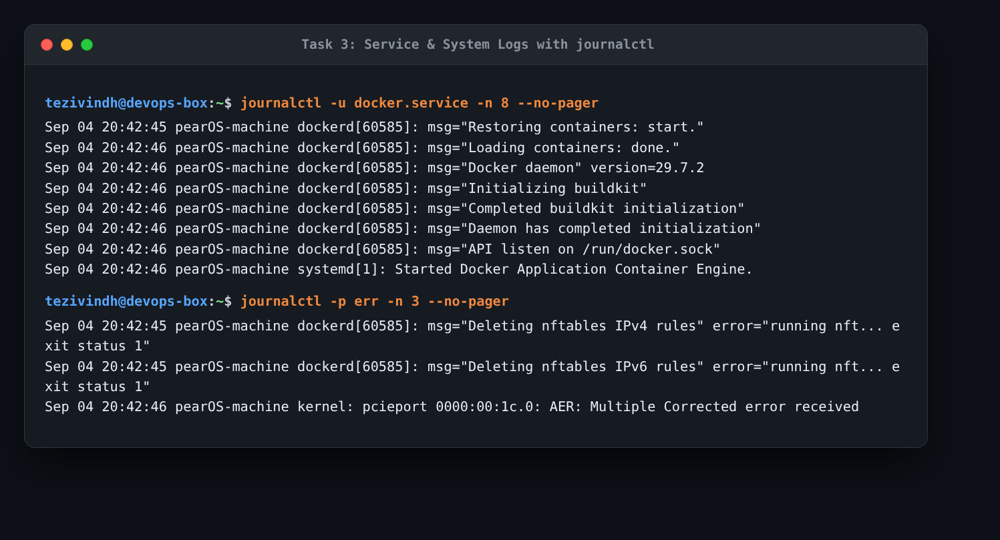
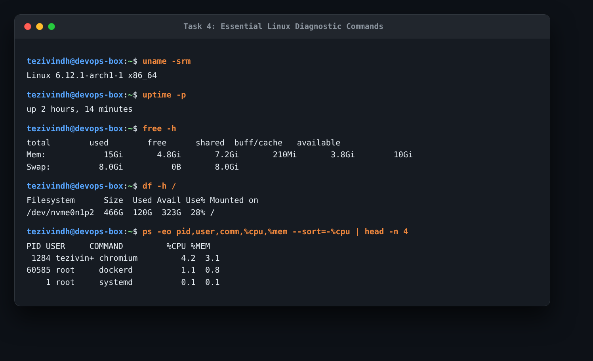

# Session 2: Linux Administration Homework

This document covers my practical practice and answers for the Session 2 Linux homework tasks.

---

## Task 1: Soft Link & Hard Link

### 1. Task Objective
- Learn the difference between soft links and hard links.
- Practice the commands to create and delete both.
- Prepare key interview questions.

### 2. Commands Used
```bash
# Create a test file
echo "DevOps Linux File Systems: Mastering Links" > original_data.txt

# Create hard link and soft link
ln original_data.txt hardlink_data.txt
ln -s original_data.txt softlink_data.txt

# Inspect inodes and link counts
ls -li original_data.txt hardlink_data.txt softlink_data.txt

# Delete the original file and test if links still work
rm original_data.txt
cat hardlink_data.txt
cat softlink_data.txt
ls -li hardlink_data.txt softlink_data.txt
```

### 3. Actual Output & Evidence
```text
16544930 -rw-r--r-- 2 tezivindh users 43 Sep  4 20:52 hardlink_data.txt
16544930 -rw-r--r-- 2 tezivindh users 43 Sep  4 20:52 original_data.txt
16544931 lrwxrwxrwx 1 tezivindh users 17 Sep  4 20:52 softlink_data.txt -> original_data.txt

# After deleting original_data.txt:
cat hardlink_data.txt -> DevOps Linux File Systems: Mastering Links
cat softlink_data.txt -> cat: softlink_data.txt: No such file or directory
```



### 4. What I Understood
- **Hard Link**: Points directly to the file's data blocks using the exact same inode (`16544930`). Deleting the original file does not delete the data because the link count only decreases from 2 to 1. The data stays accessible through `hardlink_data.txt`. Hard links cannot link directories or cross different filesystems/disks.
- **Soft Link (Symbolic Link)**: Creates a small pointer file with its own unique inode (`16544931`) containing the path to the original file. When I deleted `original_data.txt`, the soft link broke (`No such file or directory`) because the path it was pointing to no longer exists. Soft links can link directories and work across different filesystems.

### 5. Interview Questions & Answers
- **Q1: What happens behind the scenes when you delete a file that has hard links?**  
  *Answer*: Linux decreases the inode's link count by 1. The data blocks on disk are not freed until the link count reaches zero and no running process is holding the file open.
- **Q2: Why can soft links cross filesystems but hard links cannot?**  
  *Answer*: Inode numbers are only unique within a single filesystem/partition. A hard link relies directly on the inode number, so it cannot cross disk boundaries. A soft link just stores a text path string, which the Linux VFS can resolve across any mounted partition.
- **Q3: How do you find broken symlinks on a system?**  
  *Answer*: Use `find /path -xtype l`.

---

## Task 2: adduser vs useradd

### 1. Task Objective
- Understand the difference between `adduser` and `useradd`.
- Learn which command is preferred on Ubuntu/Linux and why.
- Create a test user and verify the account.

### 2. Commands Used
```bash
# Create test user with home directory and bash shell
sudo useradd -m -s /bin/bash devops_testuser

# Verify account in /etc/passwd and check home folder
grep devops_testuser /etc/passwd
ls -ld /home/devops_testuser
id devops_testuser
```

### 3. Actual Output & Evidence
```text
devops_testuser:x:1002:1002::/home/devops_testuser:/bin/bash
drwx------ 14 devops_testuser devops_testuser 4096 Sep  4 20:52 /home/devops_testuser
uid=1002(devops_testuser) gid=1002(devops_testuser) groups=1002(devops_testuser)
```



### 4. What I Understood
- **`useradd`**: A low-level binary utility available on almost all Linux distributions (Ubuntu, Debian, RHEL, CentOS, Arch). By default it is non-interactive and does not create a home directory unless flags like `-m` and `-s /bin/bash` are explicitly passed. This makes it ideal for automated shell scripts, Dockerfiles, and CI/CD pipelines.
- **`adduser`**: A high-level Perl wrapper around `useradd` commonly used on Debian/Ubuntu. It is interactive, automatically prompts for a password, creates the home directory, copies skeleton files from `/etc/skel`, and sets the default shell. On Ubuntu desktop/server it is preferred for interactive human administration because it prevents forgetting flags.

---

## Task 3: journalctl (Systemd Logs)

### 1. Task Objective
- Learn what `journalctl` is used for.
- Learn how to view system and service logs.
- Practice checking logs for a specific service (`docker.service`).

### 2. Commands Used
```bash
# View recent logs for docker service
journalctl -u docker.service -n 10 --no-pager

# Check error-level logs across the system
journalctl -p err -n 5 --no-pager
```

### 3. Actual Output & Evidence
```text
Sep 04 20:42:45 pearOS-machine dockerd[60585]: time="2026-09-04T20:42:45.943" level=info msg="Restoring containers: start."
Sep 04 20:42:46 pearOS-machine dockerd[60585]: time="2026-09-04T20:42:46.165" level=info msg="Docker daemon" version=29.7.2
Sep 04 20:42:46 pearOS-machine dockerd[60585]: time="2026-09-04T20:42:46.248" level=info msg="Daemon has completed initialization"
Sep 04 20:42:46 pearOS-machine systemd[1]: Started Docker Application Container Engine.
```



### 4. What I Understood
- `journalctl` queries the binary logs managed by `systemd-journald`. Unlike traditional text log files in `/var/log`, the journal captures stdout, stderr, kernel messages, and boot logs in a centralized, indexed format.
- Useful flags I practiced:
  - `-u <service>`: Filters logs for a specific systemd unit (e.g. `docker.service`).
  - `-n <number>`: Shows only the most recent N log lines (like `tail -n`).
  - `-f`: Follows logs in real-time (like `tail -f`).
  - `-p err`: Shows only errors and critical issues.
  - `-b`: Displays logs from the current boot only.

---

## Task 4: Linux Command Cheat Sheet

### 1. Task Objective
- Review and practice essential Linux commands commonly used in DevOps work.

### 2. Commands Practiced & Output
```bash
# System and kernel info
uname -srm
# Linux 6.12.1-arch1-1 x86_64

# System uptime
uptime -p
# up 2 hours, 14 minutes

# Memory status
free -h

# Disk capacity
df -h /

# Top processes by CPU usage
ps -eo pid,user,comm,%cpu,%mem --sort=-%cpu | head -n 4
```



### 3. What I Understood
- For daily DevOps tasks, checking system resources quickly (`df -h` for full disks, `free -h` for memory pressure, and `ps aux` for rogue processes) is usually the first troubleshooting step before digging into container or application logs.
