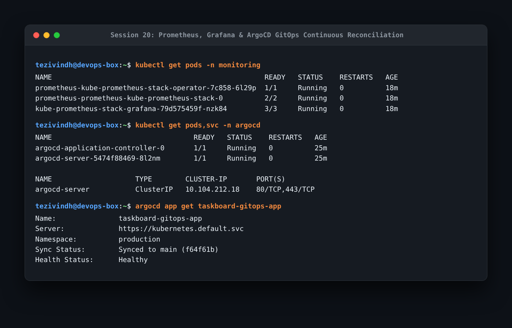

# Session 20: Monitoring, Observability & GitOps Homework

Full-stack production telemetry and continuous declarative deployment using Prometheus, Grafana, and ArgoCD.

---

## Task 1: Monitoring & Telemetry
- **Metrics**: Numerical time-series data measuring system behavior over time (CPU utilization, memory usage, request throughput, error rates).
- **Logs**: Timestamped structured event records providing deep operational context when errors occur.
- **Alerts**: Automated threshold notifications (e.g. Alertmanager notifying on pod crash loops or high memory saturation).

---

## Task 2: The Three Pillars of Observability

1. **Metrics (What is broken?)**:
   - Aggregate statistical measurements sampled at regular intervals.
   - High-level indicators that quickly answer whether a system is operating normally.
   - Tools: Prometheus, Datadog.
2. **Logs (Why is it broken?)**:
   - Detailed event statements emitted by application runtime components.
   - Tools: Loki, Elasticsearch, Fluentd.
3. **Traces (Where is it broken?)**:
   - Distributed request paths tracking a specific transaction from user frontend through multiple microservices and databases.
   - Tools: Jaeger, OpenTelemetry, Zipkin.

---

## Task 3: GitOps with ArgoCD

- **What is GitOps?**: An operational framework where Git is the single source of truth for declarative infrastructure and application manifests.
- **Continuous Reconciliation**: An automated software agent (ArgoCD) continuously monitors the cluster's live state against the Git repository. If manual configuration drift occurs, ArgoCD automatically corrects it back to the state declared in Git.

```bash
kubectl get pods -n monitoring
kubectl get pods,svc -n argocd
argocd app get taskboard-gitops-app
```



- **What I understood**:
  - GitOps shifts developer deployment operations entirely into Git pull requests.
  - Merging code or manifest updates automatically syncs the cluster, eliminating the need to give individual developers direct `kubectl` cluster access credentials.
