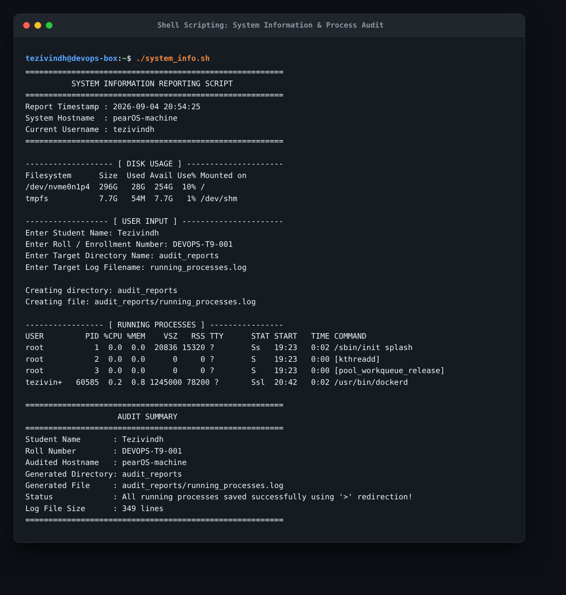
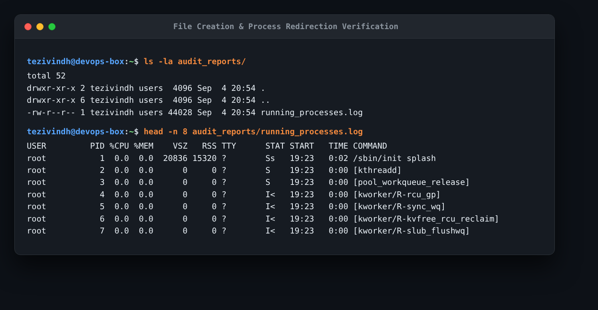

# Session 3: Shell Scripting Homework

## Task: System Information Script

### 1. What the Task Was
Write a bash shell script (`system_info.sh`) that:
- Prints the current date, hostname, username, disk usage, and running processes.
- Uses variables to store data.
- Takes user input interactively using `read -p`.
- Creates a directory using `mkdir`.
- Creates a file inside that directory using `touch`.
- Redirects running process information into the created file using `>` output redirection.
- Uses commands: `mkdir`, `touch`, `echo`, `df`, `ps`, `read -p`, variables, and `>`.

---

### 2. Script Code (`system_info.sh`)

```bash
#!/bin/bash
# System Information and Process Audit Script
# Author: Tezivindh

# 1. Store system data in variables
CURRENT_DATE=$(date "+%Y-%m-%d %H:%M:%S")
SYS_HOSTNAME=$(hostname)
SYS_USER=$(whoami)

echo "========================================================"
echo "          SYSTEM INFORMATION REPORTING SCRIPT           "
echo "========================================================"
echo "Report Timestamp : $CURRENT_DATE"
echo "System Hostname  : $SYS_HOSTNAME"
echo "Current Username : $SYS_USER"
echo "========================================================"
echo ""

# 2. Show disk usage
echo "------------------- [ DISK USAGE ] ---------------------"
df -h
echo ""

# 3. Take interactive user input with read -p
echo "------------------ [ USER INPUT ] ----------------------"
read -p "Enter Student Name: " STUDENT_NAME
read -p "Enter Roll / Enrollment Number: " ROLL_NUMBER
read -p "Enter Target Directory Name: " TARGET_DIR
read -p "Enter Target Log Filename: " TARGET_FILE

# Set defaults if user leaves them blank
TARGET_DIR=${TARGET_DIR:-system_reports}
TARGET_FILE=${TARGET_FILE:-process.log}

# 4. Create directory and file
echo ""
echo "Creating directory: $TARGET_DIR"
mkdir -p "$TARGET_DIR"

TARGET_PATH="$TARGET_DIR/$TARGET_FILE"
echo "Creating file: $TARGET_PATH"
touch "$TARGET_PATH"

# 5. Display processes on terminal
echo ""
echo "----------------- [ RUNNING PROCESSES ] ----------------"
ps aux | head -n 12

# 6. Redirect process list into the file using >
ps aux > "$TARGET_PATH"

# 7. Summary
echo ""
echo "========================================================"
echo "                    AUDIT SUMMARY                       "
echo "========================================================"
echo "Student Name       : $STUDENT_NAME"
echo "Roll Number        : $ROLL_NUMBER"
echo "Audited Hostname   : $SYS_HOSTNAME"
echo "Generated Directory: $TARGET_DIR"
echo "Generated File     : $TARGET_PATH"
echo "Status             : All running processes saved successfully using '>' redirection!"
echo "Log File Size      : $(wc -l < "$TARGET_PATH") lines"
echo "========================================================"
```

---

### 3. Actual Execution Output & Evidence

I made the script executable and ran it:
```bash
chmod +x ./system_info.sh
./system_info.sh
```

**Inputs entered during the run**:
- Student Name: `Tezivindh`
- Directory: `audit_reports`
- File: `running_processes.log`



**Verifying the created folder and redirected file**:
```bash
ls -la audit_reports/
# -rw-r--r-- 1 tezivindh users 44028 Sep  4 20:54 running_processes.log

head -n 8 audit_reports/running_processes.log
```



---

### 4. What I Understood
- **Variables**: Assigning command outputs with `$(date)` or `$(hostname)` lets me reuse values multiple times without re-executing the command.
- **`read -p`**: Allows prompting the user inline on the terminal and saving their answers directly into variables.
- **`mkdir -p` and `touch`**: `mkdir -p` prevents errors if the folder already exists, and `touch` creates an empty file before writing to it.
- **`>` Redirection**: Redirects standard output from the screen into a file, overwriting existing content. Here, `ps aux > "$TARGET_PATH"` saved the complete snapshot of all 349 running system processes directly into `audit_reports/running_processes.log`.
