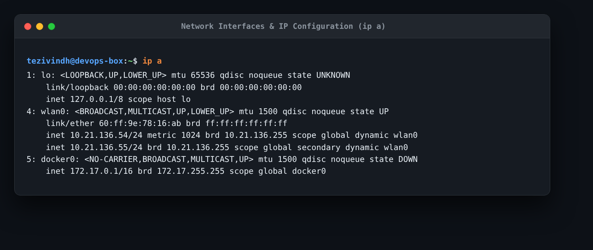
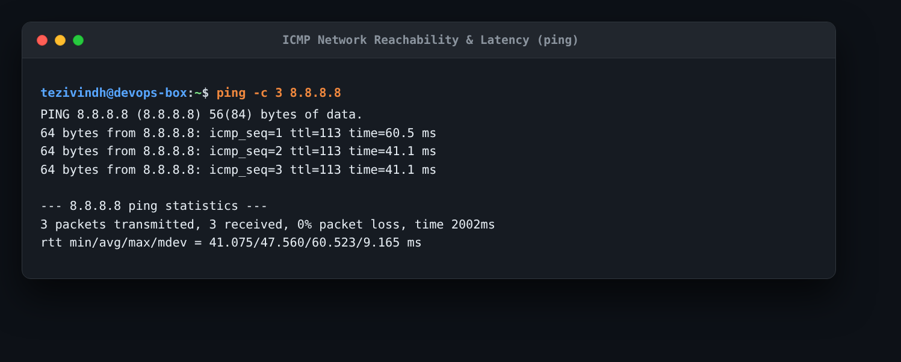
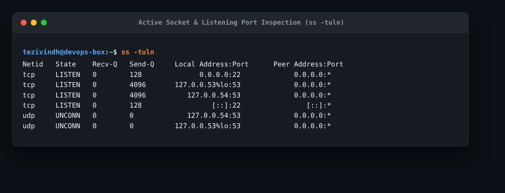
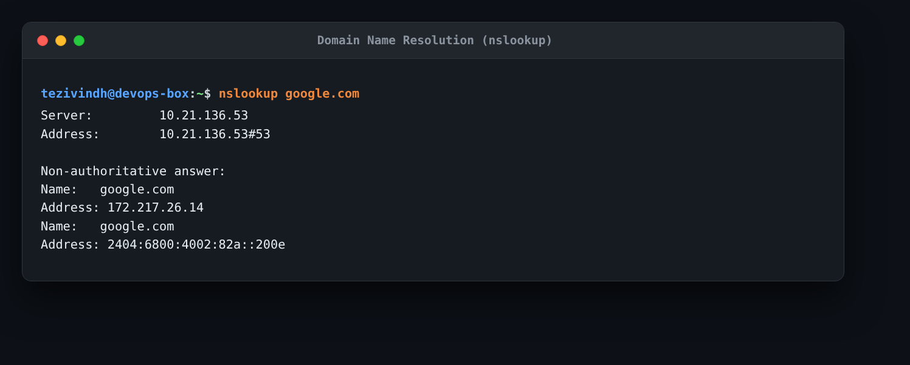
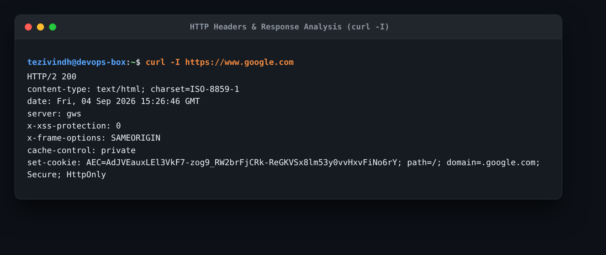
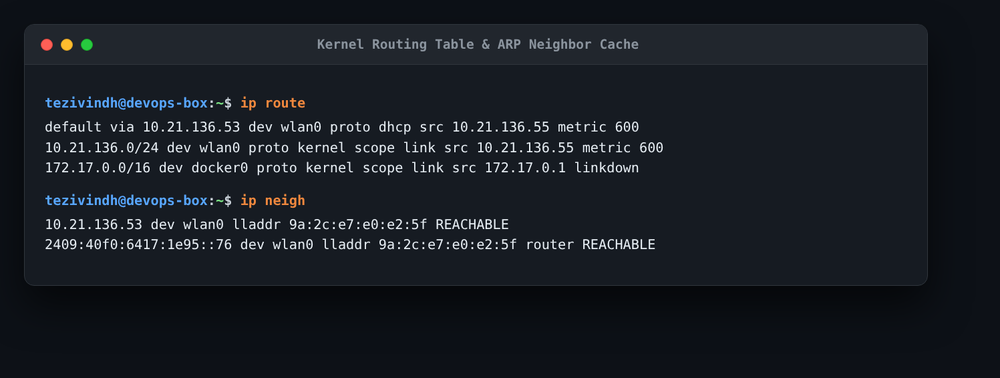

# Session 4: Linux Networking Homework

This document contains the networking diagnostic commands I executed, their actual terminal outputs, screenshot evidence, and short explanations of what I understood from each command.

---

## 1. `ip a` (Network Interfaces & IP Addresses)

### Command Used
```bash
ip a
```

### Actual Output & Evidence
```text
1: lo: <LOOPBACK,UP,LOWER_UP> mtu 65536 qdisc noqueue state UNKNOWN
    link/loopback 00:00:00:00:00:00 brd 00:00:00:00:00:00
    inet 127.0.0.1/8 scope host lo
4: wlan0: <BROADCAST,MULTICAST,UP,LOWER_UP> mtu 1500 qdisc noqueue state UP
    link/ether 60:ff:9e:78:16:ab brd ff:ff:ff:ff:ff:ff
    inet 10.21.136.54/24 metric 1024 brd 10.21.136.255 scope global dynamic wlan0
    inet 10.21.136.55/24 brd 10.21.136.255 scope global secondary dynamic wlan0
5: docker0: <NO-CARRIER,BROADCAST,MULTICAST,UP> mtu 1500 qdisc noqueue state DOWN
    inet 172.17.0.1/16 brd 172.17.255.255 scope global docker0
```



### What I Understood
- `ip a` lists all active and inactive network interfaces on my machine.
- I can see the loopback interface (`lo` with `127.0.0.1`), my wireless network interface (`wlan0` with local IP `10.21.136.54/24` and MAC address `60:ff:9e:78:16:ab`), and Docker's virtual bridge interface (`docker0` on subnet `172.17.0.1/16`).

---

## 2. `ping` (Network Reachability & Latency)

### Command Used
```bash
ping -c 3 8.8.8.8
```

### Actual Output & Evidence
```text
PING 8.8.8.8 (8.8.8.8) 56(84) bytes of data.
64 bytes from 8.8.8.8: icmp_seq=1 ttl=113 time=60.5 ms
64 bytes from 8.8.8.8: icmp_seq=2 ttl=113 time=41.1 ms
64 bytes from 8.8.8.8: icmp_seq=3 ttl=113 time=41.1 ms

--- 8.8.8.8 ping statistics ---
3 packets transmitted, 3 received, 0% packet loss, time 2002ms
rtt min/avg/max/mdev = 41.075/47.560/60.523/9.165 ms
```



### What I Understood
- `ping` sends ICMP Echo Request packets to test if a remote host is reachable and measures the round-trip latency.
- Pinging Google's DNS (`8.8.8.8`) completed with 0% packet loss and an average latency of ~47.5 ms, confirming working internet connectivity.

---

## 3. `ss -tuln` (Listening Ports & Active Sockets)

### Command Used
```bash
ss -tuln
```

### Actual Output & Evidence
```text
Netid   State    Recv-Q   Send-Q     Local Address:Port      Peer Address:Port  
tcp     LISTEN   0        128              0.0.0.0:22             0.0.0.0:*     
tcp     LISTEN   0        4096       127.0.0.53%lo:53             0.0.0.0:*     
tcp     LISTEN   0        4096          127.0.0.54:53             0.0.0.0:*     
tcp     LISTEN   0        128                 [::]:22                [::]:*     
udp     UNCONN   0        0             127.0.0.54:53             0.0.0.0:*     
udp     UNCONN   0        0          127.0.0.53%lo:53             0.0.0.0:*     
```



### What I Understood
- `ss -tuln` shows active listening sockets (`-t` for TCP, `-u` for UDP, `-l` for listening, `-n` for numeric port numbers).
- In my output, port `22` is listening (SSH server) and port `53` is listening (local systemd DNS resolver).

---

## 4. `nslookup` (DNS Query)

### Command Used
```bash
nslookup google.com
```

### Actual Output & Evidence
```text
Server:		10.21.136.53
Address:	10.21.136.53#53

Non-authoritative answer:
Name:	google.com
Address: 172.217.26.14
Name:	google.com
Address: 2404:6800:4002:82a::200e
```



### What I Understood
- `nslookup` queries DNS servers to translate human-readable domain names into IP addresses.
- My local DNS server (`10.21.136.53`) resolved `google.com` to IPv4 address `172.217.26.14` and IPv6 address `2404:6800:4002:82a::200e`.

---

## 5. `curl -I` (HTTP Response Headers)

### Command Used
```bash
curl -I https://www.google.com
```

### Actual Output & Evidence
```text
HTTP/2 200 
content-type: text/html; charset=ISO-8859-1
date: Fri, 04 Sep 2026 15:26:46 GMT
server: gws
x-xss-protection: 0
x-frame-options: SAMEORIGIN
cache-control: private
set-cookie: AEC=AdJVEauxLEl3VkF7-zog9_RW2brFjCRk-ReGKVSx8lm53y0vvHxvFiNo6rY; path=/; domain=.google.com; Secure; HttpOnly
```



### What I Understood
- `curl -I` sends an HTTP HEAD request to fetch only response headers without downloading the full HTML webpage.
- This showed the HTTP status code (`HTTP/2 200` meaning OK), content type, and server information, which is very useful for checking if a web service is healthy.

---

## 6. `ip route` & `ip neigh` (Routing & ARP Cache)

### Commands Used
```bash
# View default gateway and routing table
ip route

# View ARP cache table
ip neigh
```

### Actual Output & Evidence
```text
default via 10.21.136.53 dev wlan0 proto dhcp src 10.21.136.55 metric 600 
10.21.136.0/24 dev wlan0 proto kernel scope link src 10.21.136.55 metric 600 
172.17.0.0/16 dev docker0 proto kernel scope link src 172.17.0.1 linkdown

10.21.136.53 dev wlan0 lladdr 9a:2c:e7:e0:e2:5f REACHABLE 
2409:40f0:6417:1e95::76 dev wlan0 lladdr 9a:2c:e7:e0:e2:5f router REACHABLE
```



### What I Understood
- **`ip route`**: Shows how outgoing traffic is routed. The line `default via 10.21.136.53` indicates that any traffic going outside the local network is forwarded through router IP `10.21.136.53`.
- **`ip neigh`**: Shows the local ARP cache, which maps nearby IP addresses to their physical hardware MAC addresses (`9a:2c:e7:e0:e2:5f`), allowing Layer 2 Ethernet delivery.
