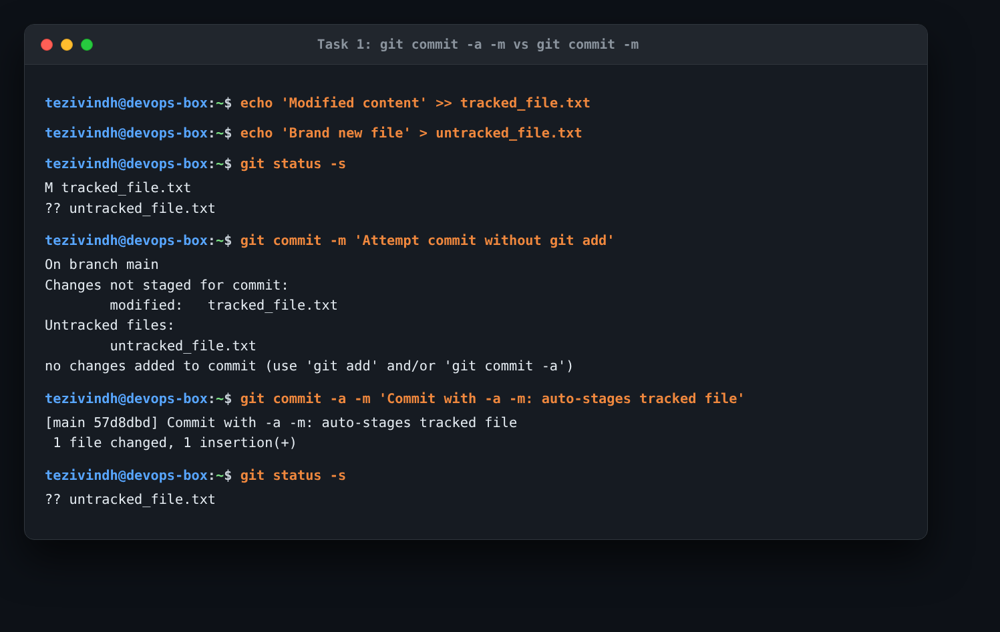
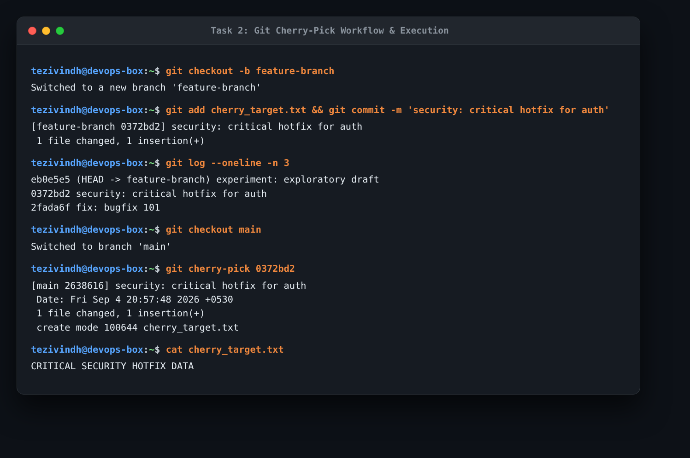
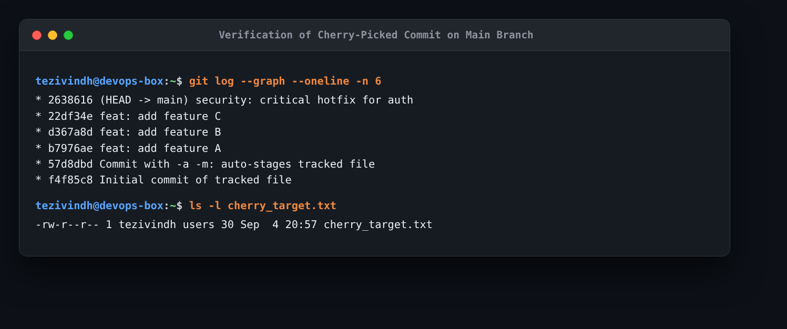

# Session 5: Git & GitHub Homework

This document covers my practical practice for Git commit flags (`-a -m` vs `-m`) and the `git cherry-pick` workflow.

---

## Task 1: `git commit -a -m` vs `git commit -m`

### 1. What the Task Was
- Practice `git commit -a -m "message"`.
- Understand the difference between `git commit -a -m` and `git commit -m`.
- Test both commands on tracked and untracked files to observe the difference.

### 2. Commands Used
```bash
# 1. Modify an existing tracked file and create a new untracked file
echo "Modified content" >> tracked_file.txt
echo "Brand new file" > untracked_file.txt
git status -s

# 2. Try committing with git commit -m without staging first
git commit -m "Attempt commit without git add"

# 3. Now commit using git commit -a -m
git commit -a -m "Commit with -a -m: auto-stages tracked file"
git status -s
```

### 3. Actual Output & Evidence
```text
# Step 1: Status before commit
 M tracked_file.txt
?? untracked_file.txt

# Step 2: Running git commit -m
On branch main
Changes not staged for commit:
	modified:   tracked_file.txt
Untracked files:
	untracked_file.txt
no changes added to commit (use "git add" and/or "git commit -a")

# Step 3: Running git commit -a -m
[main 57d8dbd] Commit with -a -m: auto-stages tracked file
 1 file changed, 1 insertion(+)

# Step 4: Status after commit
?? untracked_file.txt
```



### 4. What I Understood
- **`git commit -m`**: Only commits files that are already in the staging area (`git add`). If I modify a tracked file and try `git commit -m`, Git refuses with `"no changes added to commit"`.
- **`git commit -a -m`**: Automatically stages and commits any modifications or deletions to **already tracked** files in a single step without needing to run `git add` first.
- **Important Catch**: `-a` only works on tracked files. The new `untracked_file.txt` remained untouched (`?? untracked_file.txt`) and was not committed. New files must always be added explicitly with `git add`.

---

## Task 2: Git Cherry-Pick

### 1. What the Task Was
- Create 2–4 commits in the `main` branch.
- Use `git log` to view commits.
- Create a new branch and make 2–3 commits on it.
- Use `git log` to identify a specific commit hash on the new branch.
- Cherry-pick that specific commit into the `main` branch.
- Verify that the selected commit is now present in the `main` branch.

### 2. Commands Used
```bash
# 1. Create 3 commits on main branch
echo "Feature A" > featureA.txt && git add featureA.txt && git commit -m "feat: add feature A"
echo "Feature B" > featureB.txt && git add featureB.txt && git commit -m "feat: add feature B"
echo "Feature C" > featureC.txt && git add featureC.txt && git commit -m "feat: add feature C"
git log --oneline

# 2. Create and checkout a feature branch
git checkout -b feature-branch

# 3. Make 3 commits on feature-branch
echo "Bugfix 101" > bugfix1.txt && git add bugfix1.txt && git commit -m "fix: bugfix 101"
echo "CRITICAL SECURITY HOTFIX DATA" > cherry_target.txt && git add cherry_target.txt && git commit -m "security: critical hotfix for auth"
echo "Experimental test" > experimental.txt && git add experimental.txt && git commit -m "experiment: exploratory draft"

# 4. View log to find target commit hash
git log --oneline -n 3

# 5. Switch back to main and verify target file does not exist yet
git checkout main
ls cherry_target.txt

# 6. Cherry-pick target commit (0372bd2) into main
git cherry-pick 0372bd2

# 7. Verify the change is now on main
cat cherry_target.txt
git log --graph --oneline -n 6
```

### 3. Actual Output & Evidence
```text
# Finding the commit hash on feature-branch:
eb0e5e5 (HEAD -> feature-branch) experiment: exploratory draft
0372bd2 security: critical hotfix for auth
2fada6f fix: bugfix 101

# Checking out main (file does not exist):
ls: cannot access 'cherry_target.txt': No such file or directory

# Cherry-picking:
[main 2638616] security: critical hotfix for auth
 1 file changed, 1 insertion(+)
 create mode 100644 cherry_target.txt

# Verifying file content on main:
CRITICAL SECURITY HOTFIX DATA

# Verifying git log on main:
* 2638616 (HEAD -> main) security: critical hotfix for auth
* 22df34e feat: add feature C
* d367a8d feat: add feature B
* b7976ae feat: add feature A
* 57d8dbd Commit with -a -m: auto-stages tracked file
* f4f85c8 Initial commit of tracked file
```




### 4. What I Understood
- `git cherry-pick` lets me grab one specific commit from another branch and apply it to my current branch without having to merge the entire branch.
- Notice that on `feature-branch`, the commit hash was `0372bd2`, but after cherry-picking it onto `main`, Git created a new commit object with hash `2638616`. This happens because the parent commit on `main` is different, so the resulting SHA-1 hash changes while preserving the exact diff and commit message.
- In real DevOps work, this is commonly used when a critical bugfix or security patch needs to be pushed immediately to production (`main`) from an ongoing development branch without releasing unfinished features.
