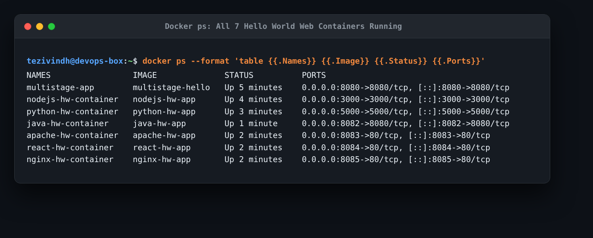
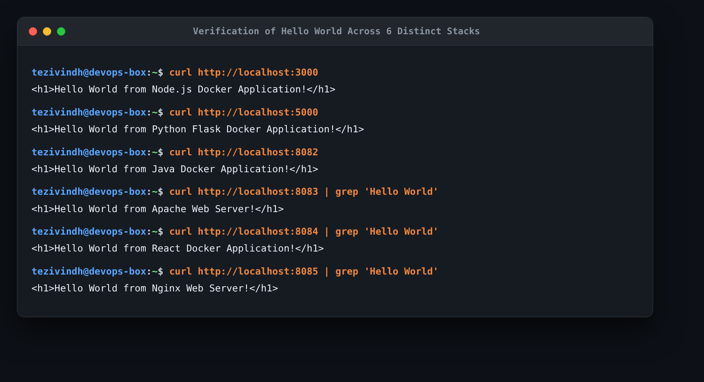

# Session 6 & 7: Docker Homework

This repository contains my completed Docker homework tasks: building and running 6 distinct "Hello World" web applications, followed by an optimized multi-stage build running on port 8080.

---

## Part 1: Hello World Web Applications

### 1. What the Task Was
Create simple Hello World web applications using Docker for:
1. Node.js application (Express) -> `nodejs-app/`
2. Python application (Flask) -> `python-app/`
3. Java application (HTTP Server) -> `java-app/`
4. Apache web server -> `Apache-app/`
5. React application -> `React-app/`
6. Nginx application -> `nginx-app/`

For each application:
- Create the specified folder name.
- Add the application code.
- Write a `Dockerfile`.
- Build the Docker image.
- Run the container and verify that "Hello World" displays on the webpage.

---

### 2. Summary of Created Applications

| Application | Folder | Technology / Image | Port Mapped | Verification Response |
| :--- | :--- | :--- | :---: | :--- |
| **Node.js** | `nodejs-app/` | `node:20-alpine` (Express) | `3000:3000` | `<h1>Hello World from Node.js Docker Application!</h1>` |
| **Python** | `python-app/` | `python:3.11-slim` (Flask) | `5000:5000` | `<h1>Hello World from Python Flask Docker Application!</h1>` |
| **Java** | `java-app/` | `amazoncorretto:17-alpine` | `8082:8080` | `<h1>Hello World from Java Docker Application!</h1>` |
| **Apache** | `Apache-app/` | `httpd:alpine` | `8083:80` | `<h1>Hello World from Apache Web Server!</h1>` |
| **React** | `React-app/` | `nginx:alpine` (React SPA) | `8084:80` | `<h1>Hello World from React Docker Application!</h1>` |
| **Nginx** | `nginx-app/` | `nginx:alpine` | `8085:80` | `<h1>Hello World from Nginx Web Server!</h1>` |

---

### 3. How I Built & Ran Each Container

```bash
# 1. Node.js
cd nodejs-app
docker build -t nodejs-hw-app .
docker run -d -p 3000:3000 --name nodejs-hw-container nodejs-hw-app

# 2. Python
cd ../python-app
docker build -t python-hw-app .
docker run -d -p 5000:5000 --name python-hw-container python-hw-app

# 3. Java
cd ../java-app
docker build -t java-hw-app .
docker run -d -p 8082:8080 --name java-hw-container java-hw-app

# 4. Apache
cd ../Apache-app
docker build -t apache-hw-app .
docker run -d -p 8083:80 --name apache-hw-container apache-hw-app

# 5. React
cd ../React-app
docker build -t react-hw-app .
docker run -d -p 8084:80 --name react-hw-container react-hw-app

# 6. Nginx
cd ../nginx-app
docker build -t nginx-hw-app .
docker run -d -p 8085:80 --name nginx-hw-container nginx-hw-app
```

---

### 4. Actual Output & Evidence

**Verifying all 6 containers running simultaneously with `docker ps`**:
```bash
docker ps --format "table {{.Names}}\t{{.Image}}\t{{.Status}}\t{{.Ports}}"
```



**Verifying HTTP output for each app with `curl`**:
```bash
curl http://localhost:3000
curl http://localhost:5000
curl http://localhost:8082
curl http://localhost:8083 | grep "Hello World"
curl http://localhost:8084 | grep "Hello World"
curl http://localhost:8085 | grep "Hello World"
```



### 5. What I Understood
- Each technology has standard patterns for containerization:
  - Interpreted languages like **Node.js** and **Python** need dependencies copied (`package.json` or `requirements.txt`) and installed before copying source code, taking advantage of Docker's layer cache.
  - Compiled languages like **Java** require running `javac` inside the build step.
  - Static web servers like **Apache** and **Nginx** simply copy the built HTML/JS assets into the web root (`/usr/local/apache2/htdocs` or `/usr/share/nginx/html`).
- Using `-p host:container` lets each web app bind to its own unique host port so multiple containers can run at the same time without port conflicts.

---

## Part 2: Multi-Stage Dockerfile (Port 8080)

### 1. What the Task Was
- Build an image using a multi-stage Dockerfile.
- Run the container and access it on port `8080`.
- Verify the output displays: `Hello World from Docker multi-stage build`.
- Verify the running container using `docker ps`.
- Create documentation with student name and enrollment number.

See full documentation and student details in [`multi-stage-dockerfile/README.md`](multi-stage-dockerfile/README.md).

### 2. Commands Used & Verification
```bash
cd multi-stage-dockerfile
docker build -t multistage-hello .
docker run -d -p 8080:8080 --name multistage-app multistage-hello

# Verify port 8080 and message
curl http://localhost:8080
docker ps --filter "name=multistage-app"
```


### 3. What I Understood
- Multi-stage builds use multiple `FROM` statements in one Dockerfile.
- In **Stage 1 (builder)**, we install full development dependencies and compile the application.
- In **Stage 2 (production)**, we start from a clean, lightweight image and only copy over the final production artifacts with `COPY --from=builder`. This keeps the final image small, fast to download, and much more secure in production.
