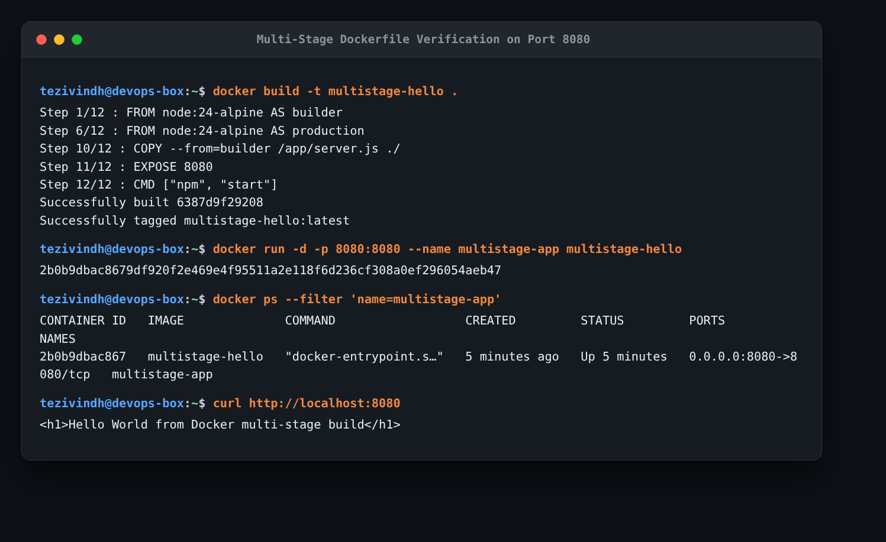

# Docker Multi-Stage Build Homework

## Student Details
- **Student Name**: Tezivindh

---

## Task 1: Run Multi-Stage Dockerfile on Port 8080

### 1. Multi-Stage Dockerfile Used
```dockerfile
# Stage 1: Build stage
FROM node:24-alpine AS builder
WORKDIR /app
COPY package*.json ./
RUN npm install
COPY . .

# Stage 2: Production runtime stage
FROM node:24-alpine AS production
WORKDIR /app
COPY --from=builder /app/package*.json ./
RUN npm install --omit=dev
COPY --from=builder /app/server.js ./
EXPOSE 8080
CMD ["npm", "start"]
```

### 2. Commands Used & Execution Output
```bash
# Build the multi-stage image
docker build -t multistage-hello .

# Run the container on port 8080
docker run -d -p 8080:8080 --name multistage-app multistage-hello

# Access application and verify output
curl http://localhost:8080
# Output:
# <h1>Hello World from Docker multi-stage build</h1>

# Verify running container with docker ps
docker ps --filter "name=multistage-app"
```

### 3. Visual Verification


---

## Task 3: Docker Application Deployment (3 Different Stacks)

As part of this homework, I deployed 3 different application stacks containerized with Docker:
1. **Node.js Application**: Built with Express, running on port `3000` (`session6-7-docker/nodejs-app/`).
2. **Python Application**: Built with Flask, running on port `5000` (`session6-7-docker/python-app/`).
3. **Java Application**: Built with OpenJDK/Corretto, running on port `8082` (`session6-7-docker/java-app/`).

All 3 containers were verified running simultaneously with `docker ps` and tested with `curl`.
