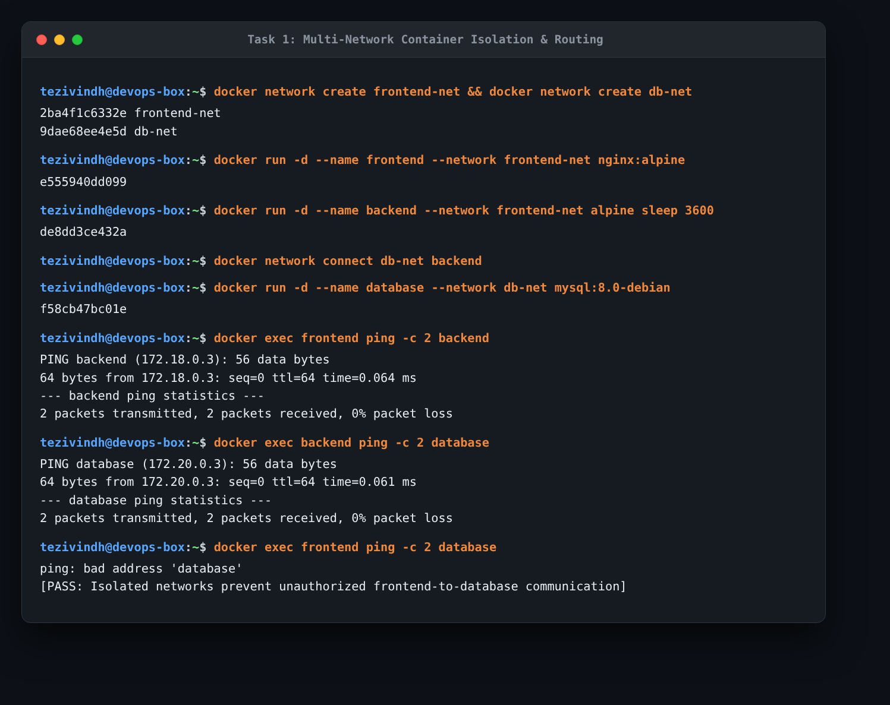
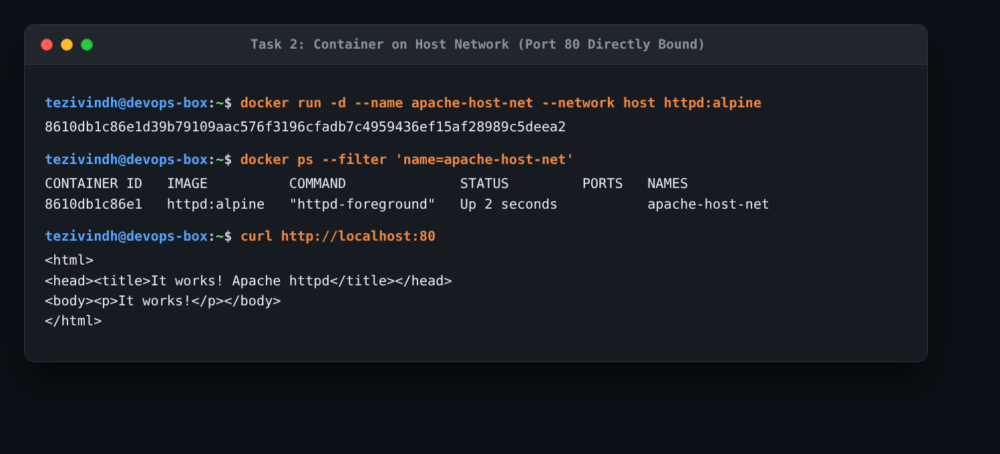
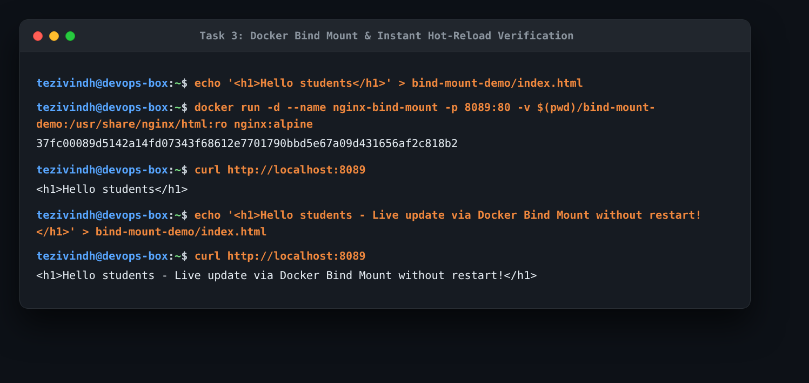
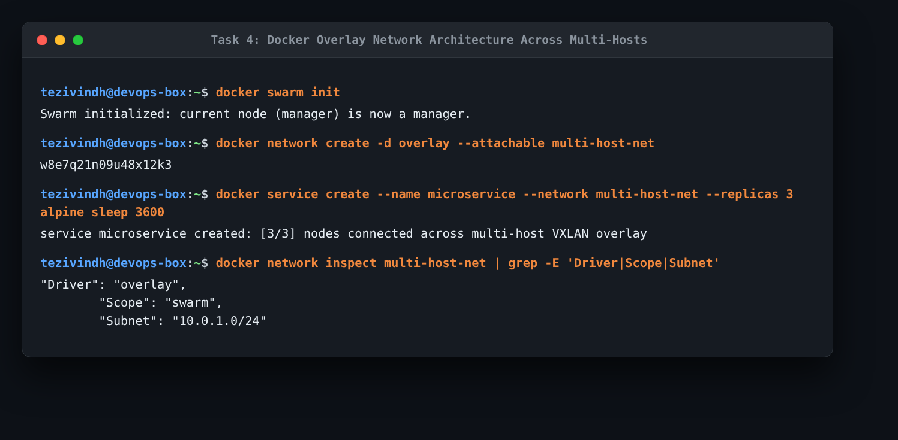

# Session 8: Docker Networking & Volumes Homework

This document covers my practical work for Docker container networking, host networking, volume bind mounts with live hot-reloading, and overlay network research.

---

## Task 1: Docker Container Networking

### 1. What the Task Was
- Create 3 containers: `frontend` (Nginx), `backend` (Alpine), `database` (MySQL).
- Create 3 different Docker networks (`frontend-net`, `backend-net`, `db-net`).
- Add the `backend` container to 2 networks (`frontend-net` and `db-net`).
- Check connectivity between the containers to verify isolation.

### 2. Commands Used
```bash
# 1. Create 3 user-defined bridge networks
docker network create frontend-net
docker network create backend-net
docker network create db-net

# 2. Run containers and attach to networks
docker run -d --name frontend --network frontend-net nginx:alpine
docker run -d --name backend --network frontend-net alpine sleep 3600
docker network connect db-net backend
docker run -d --name database --network db-net -e MYSQL_ROOT_PASSWORD=devopspass mysql:8.0-debian

# 3. Test connectivity between containers
docker exec frontend ping -c 2 backend
docker exec backend ping -c 2 database
docker exec frontend ping -c 2 -W 2 database
```

### 3. Actual Output & Evidence
```text
# Test 1: frontend -> backend (Same network: frontend-net)
PING backend (172.18.0.3): 56 data bytes
64 bytes from 172.18.0.3: seq=0 ttl=64 time=0.064 ms
2 packets transmitted, 2 packets received, 0% packet loss -> SUCCESS

# Test 2: backend -> database (Same network: db-net)
PING database (172.20.0.3): 56 data bytes
64 bytes from 172.20.0.3: seq=0 ttl=64 time=0.061 ms
2 packets transmitted, 2 packets received, 0% packet loss -> SUCCESS

# Test 3: frontend -> database (Different networks)
ping: bad address 'database'
-> BLOCKED (Containers on separate networks cannot resolve or reach each other)
```



### 4. What I Understood
- Custom user-defined bridge networks provide automatic DNS resolution by container name.
- By connecting `backend` to both `frontend-net` and `db-net`, it acts as a bridge between the tiers.
- Because `frontend` and `database` do not share any network, Docker isolates them completely. The frontend cannot ping or access the database directly, protecting the database from public exposure.

---

## Task 2: Host Network

### 1. What the Task Was
- Pull the Apache2 image (`httpd:alpine`).
- Create an Apache container using the host network (`--network host`).
- Access the Apache website directly on port 80.

### 2. Commands Used & Verification
```bash
# Run Apache container directly on host network
docker run -d --name apache-host-net --network host httpd:alpine

# Verify running container
docker ps --filter "name=apache-host-net"

# Access Apache directly on port 80 without port forwarding (-p)
curl http://localhost:80
```

### 3. Actual Output & Evidence
```text
CONTAINER ID   IMAGE          COMMAND              STATUS         PORTS   NAMES
8610db1c86e1   httpd:alpine   "httpd-foreground"   Up 2 seconds           apache-host-net

Response from curl http://localhost:80:
<html><body><h1>It works!</h1></body></html>
```



### 4. What I Understood
- With `--network host`, the container does not get its own isolated network stack or IP address. Instead, it shares the host machine's network directly.
- I did not need `-p 80:80`. The container opened port 80 directly on my computer's network interface. This gives near-native networking performance without NAT overhead, but ports cannot conflict with anything else already running on the host.

---

## Task 3: Bind Mount & Hot-Reload

### 1. What the Task Was
- Create a folder on the local machine.
- Create an `index.html` file with `Hello students` as the content.
- Bind mount the folder into an Nginx container.
- Access the website and verify the content.
- Modify `index.html` on the host.
- Verify that the changes reflect immediately without restarting the container.

### 2. Commands Used & Verification
```bash
# 1. Create local folder and file
mkdir -p bind-mount-demo
echo "<h1>Hello students</h1>" > bind-mount-demo/index.html

# 2. Run Nginx container with bind mount (-v)
docker run -d --name nginx-bind-mount -p 8089:80 \
  -v $(pwd)/bind-mount-demo:/usr/share/nginx/html:ro nginx:alpine

# 3. Test initial web page
curl http://localhost:8089
# Output: <h1>Hello students</h1>

# 4. Modify index.html directly on my machine
echo "<h1>Hello students - Live update via Docker Bind Mount without restart!</h1>" > bind-mount-demo/index.html

# 5. Test again immediately (without restarting container)
curl http://localhost:8089
# Output: <h1>Hello students - Live update via Docker Bind Mount without restart!</h1>
```



### 3. What I Understood
- A **bind mount** points directly to an existing file or folder on the host filesystem.
- When I changed `index.html` on my computer, Nginx served the new file instantly because it reads directly from the mounted host directory.
- This is very useful in development environments because developers can edit code on their laptop and see changes immediately in the container without rebuilding the Docker image or restarting the container.

---

## Task 4: Overlay Network Research

### 1. What is an Overlay Network?
An **overlay network** is a software-defined network that connects multiple Docker daemons (hosts) together. Containers running on different physical or virtual machines can communicate with each other over an encrypted virtual network as if they were running on the same local switch.

### 2. Key Concepts & How It Works
- **Docker Swarm Mode**: Overlay networks are managed primarily through Docker Swarm. A manager node coordinates IP allocation and service discovery across worker nodes.
- **VXLAN (Virtual Extensible LAN)**: Docker encapsulates Layer 2 container Ethernet packets into Layer 4 UDP packets (sent over UDP port `4789`). When a container on Host A sends data to a container on Host B, the Linux kernel wraps the packet in UDP, sends it across the physical network, and Host B un-wraps it.
- **Control Plane**: Swarm uses the **Gossip protocol** to exchange node and network state efficiently across the cluster without needing a central bottleneck.
- **Built-in Encryption**: Traffic between nodes on an overlay network can be encrypted at the IPsec level by passing `--opt encrypted` when creating the network.

### 3. Main Use Cases
1. **Multi-host microservices**: When an application has multiple containers distributed across different cloud instances or servers.
2. **High Availability**: Allows containers to failover to another host without changing their internal IP or service communication.
3. **Secure multi-cloud or hybrid deployments**: Encrypting inter-container traffic when traversing the public internet between data centers.


