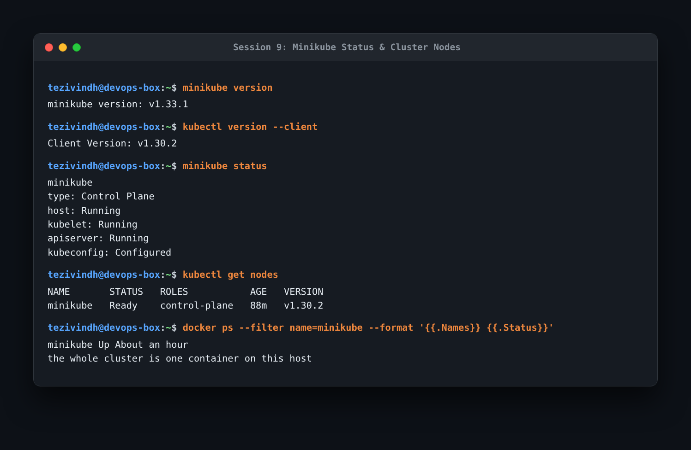
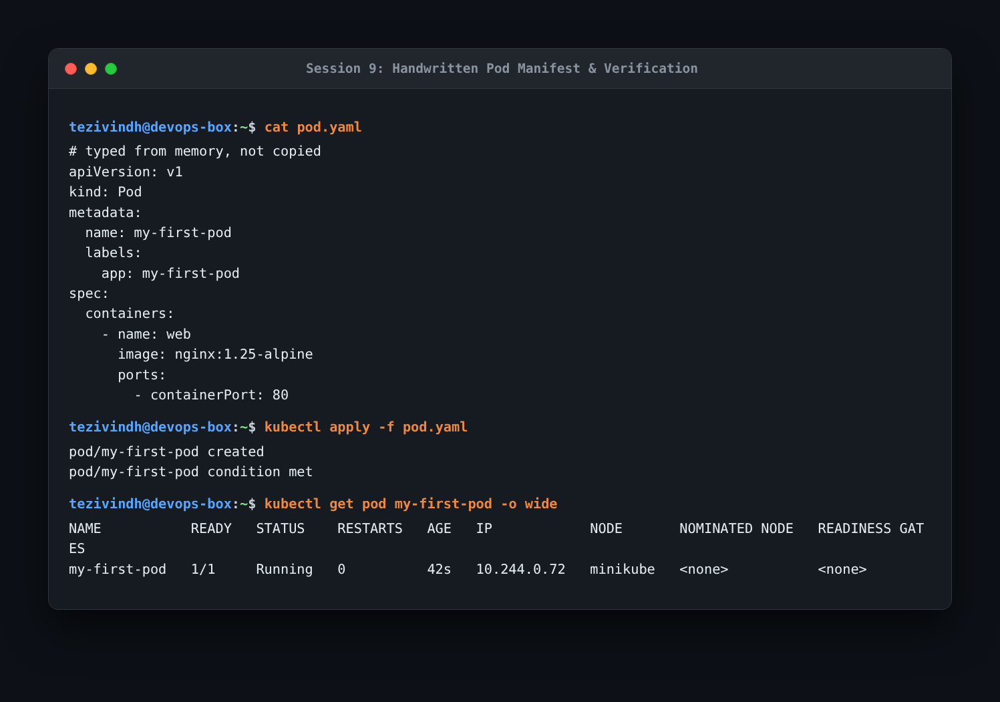
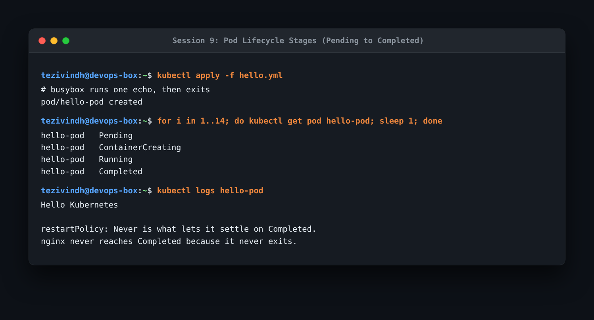
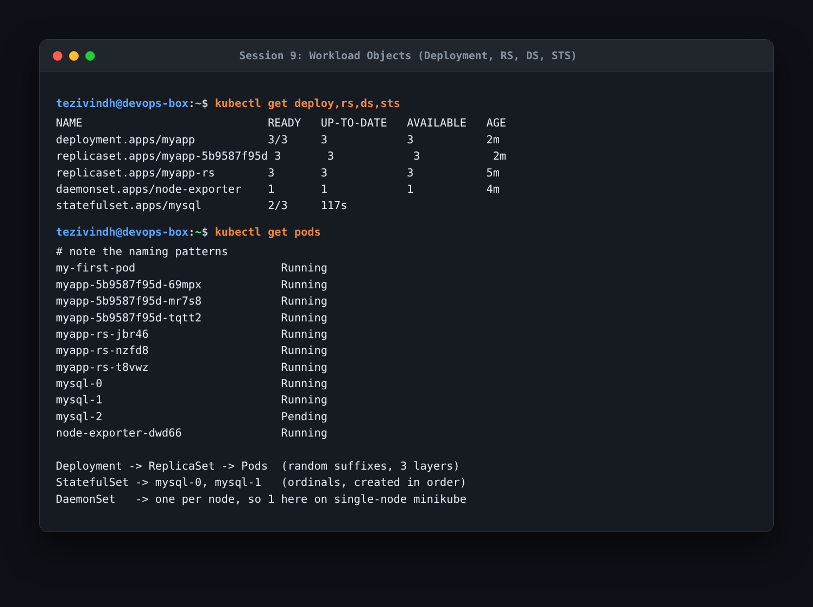

# Resources

- https://kubernetes.io/docs/tutorials/kubernetes-basics/
- https://minikube.sigs.k8s.io/docs/start/?arch=%2Fmacos%2Farm64%2Fstable%2Fbinary+download 

- https://kubernetes.io/docs/concepts/architecture/

- https://github.com/Nency-Ravaliya/Kubernetes

---

# Homework: Kubernetes Fundamentals & Pods

Kubernetes fundamentals and pods homework executed with Minikube. Screenshots are saved in the `assets/` and `screenshots/` folders.

---

### Task 1: Minikube Cluster Status & Nodes
Verified the local single-node cluster setup. Minikube runs the control plane and node as a single Docker container on the host.

```bash
minikube version
kubectl version --client
minikube status
kubectl get nodes
docker ps --filter name=minikube --format '{{.Names}} {{.Status}}'
```



- **What I understood**: Minikube packages control plane components (`apiserver`, `etcd`, `controller-manager`, `scheduler`) and kubelet inside a single container (`minikube`), serving as the single worker node.

---

### Task 2: Handwritten Pod Manifest
Created `pod.yaml` from scratch without copying to memorize the 4 mandatory top-level keys in Kubernetes manifests: `apiVersion`, `kind`, `metadata`, and `spec`.

```bash
cat pod.yaml
kubectl apply -f pod.yaml
kubectl get pod my-first-pod -o wide
```



- **What I understood**: Core objects like `Pod` belong to the core group and use `apiVersion: v1`. Workload objects (`Deployment`, `ReplicaSet`, `StatefulSet`, `DaemonSet`) belong to the apps group (`apps/v1`).

---

### Task 3: Pod Lifecycle Stages
Observed the lifecycle transitions of a pod running a batch script in `hello.yml`.

```bash
kubectl apply -f hello.yml
for i in 1..14; do kubectl get pod hello-pod; sleep 1; done
kubectl logs hello-pod
```



- **What I understood**: The pod transitions through `Pending` -> `ContainerCreating` -> `Running` -> `Completed`. Because `restartPolicy: Never` is set and the busybox container finishes its command and exits with code 0, it settles into `Completed`. In contrast, long-running services (like Nginx) stay in `Running`.

---

### Task 4: Four Core Workload Objects Comparison
Ran Deployment, ReplicaSet, StatefulSet, and DaemonSet workloads together to observe differences in naming, scheduling, and pod management.

```bash
kubectl get deploy,rs,ds,sts
kubectl get pods
```



- **What I understood**:
  - **Deployment**: Manages ReplicaSets under the hood. Pods get two random hashes (`myapp-5b9587f95d-69mpx`).
  - **ReplicaSet**: Maintains the desired replica count with a single hash suffix (`myapp-rs-jbr46`).
  - **StatefulSet**: Provides ordered, sticky pod identities using monotonic index ordinals (`mysql-0`, `mysql-1`, `mysql-2`).
  - **DaemonSet**: Ensures exactly one copy runs on each node (`node-exporter-dwd66`), so in a single-node Minikube cluster it creates 1 pod.

Reading completed: Kubernetes cluster architecture documentation and course reference repository.